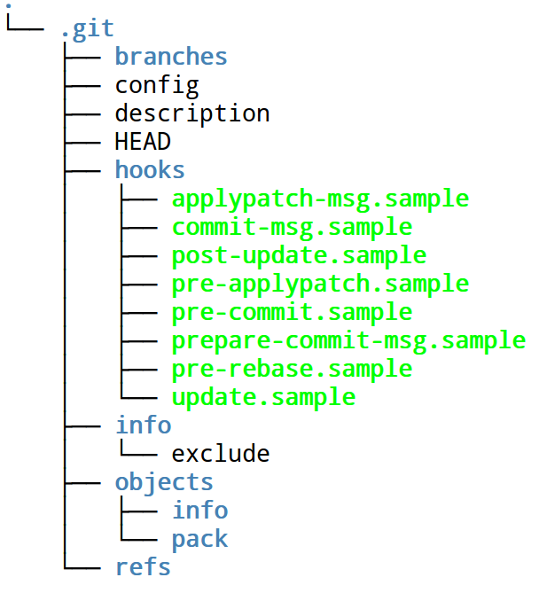

## *Hooks*: ejecutando código tras una orden git

### Objetivos

* Entender el concepto de *fontanería* y *loza*
* Entender el concepto de *hooks* o *puntos de enganche*
* Entender las órdenes menos usuales de git usadas desde los *hooks*
* Saber adaptar *hooks* para una labor determinada
 
### Viendo las cañerías: estructura de un repositorio `git`

Cuando se crea por primera vez un repositorio veremos que aparecen misteriosamente una serie de ficheros con esta estructura dentro del directorio `.git`.



`branches` lo dejamos de lado porque ya no se usa (aunque por alguna razón se sigue creando). `config`, `HEAD`, `refs` y `objects` son ficheros o directorios que almacenan información dinámica, por ejemplo `config` almacena las variables de configuración (que se han visto anteriormente). El resto de los ficheros y directorios se copian de una *plantilla*; esta plantilla se instala con `git` y se usa cada vez que hacemos `clone` o `init`, y contiene `hooks`, `description`, `branches` e `info` y los ficheros que se encuentran dentro de ellos. 

Esta plantilla la podemos modificar y cambiar. La plantilla que se usa por omisión se encuentra en `/usr/share/git-core/templates/` y contiene una serie de ficheros junto con ejemplos (*samples*) para ganchos. Sin embargo, podemos personalizar nuestra plantilla editando (con permiso de superusuario) estos ficheros o bien usando la opción `--template <nombre de directorio>` de `clone` o `init`. En ese caso, en vez de copiar los ficheros por omisión, copiará los contenidos en ese directorio.

Por ejemplo, se puede usar [esta plantilla](http://jj.github.io/repo-plantilla) que elimina los ficheros de ejemplo, sustituye por otro y traduce los contenidos de los otros ficheros al castellano; también mete en los patrones ignorados (sin necesidad de usar `.gitignore`) los ficheros que terminan en `~`, que produce Emacs como copia de seguridad.

Estos ficheros forman parte de las cañerías de `git` y podemos cambiar su comportamiento editando `config` como ya se ha visto en el capítulo de uso básico; de hecho, existe también un fichero de configuración a nivel global, `.gitconfig` que sigue el mismo formato y que ya hemos visto

```
[alias]
	ci = commit
	st = status
[core]
	editor = emacs
```

Estos ficheros de configuración siguen un formato similar al de los ficheros `.ini`, es decir, bloques definidos entre corchetes y variables con valor, dentro de ese bloque, a las que se le asigna usando `=`. En este caso [definimos dos alias](http://wildlyinaccurate.com/useful-git-configuration-items) y un editor o, mejor dicho, *el* editor. Esto podemos hacerlo tanto en el fichero global como en el local si queremos que afecte sólo a nuestro repositorio.

Otro fichero dentro de este directorio que se puede modificar es `.git/info/exclude`; es similar a `.gitignore`, salvo que en este caso afectará solamente a nuestra copia local del repositorio y no a todas las copias del mismo. Por ejemplo, podemos editerlo de esta forma

```
# git ls-files --others --exclude-from=.git/info/exclude
# Lines that start with '#' are comments.
# For a project mostly in C, the following would be a good set of
# exclude patterns (uncomment them if you want to use them):
# *.[oa]
*~
``` 
para excluir los ficheros de copia de seguriad de Emacs (que hemos definido antes como editor) que nos interesa evitar a nosotros, pero que puede que tengan un significado especial para otro usuario del repo y que por tanto no quiera evitar. 

Por supuesto, el tema principal de este capítulo está en el otro directorio, *hooks*, cuyo contenido tendremos que cambiar si queremos añadir ganchos al repositorio. Pero para usarlo necesitamos también conocer algunos conceptos más de git, empezando por cómo se accede a más cañerías. 

### Paso a paso

Si miramos en el directorio `.git/objects` encontraremos una serie de
directorios con nombres de dos letras, dentro de los cuales están los
objetos de git, que tienen otras 38 letras para componer las 40 letras
que componen el nombre único de cada objeto; este nombre se genera a
partir del contenido usando
[SHA1](http://en.wikipedia.org/wiki/SHA-1). 

`git` almacena toda la información en ese directorio y de hecho está
[organizado para acceder a la información almacenada por contenido](http://git-scm.com/book/en/Git-Internals). Por
eso tenemos que imaginarlo como un sistema de ficheros normal, con una
raíz (que es HEAD, el punto en el que se encuentra el repositorio en
este momento) y una serie de ramas que apuntan a ficheros y a
diferentes versiones de los mismos.

git, entonces, [procede de la forma siguiente](http://git-scm.com/book/en/Git-Internals-Git-Objects).

1. Crea un SHA1 a partir del contenido del fichero cambiado o añadido. Este fichero
se almacena en la zona temporal en forma de *blob*. 
2.  El nombre del fichero se almacena en un árbol, junto con el nombre
de otros ficheros que estén, en ese momento, en la zona temporal. Un
árbol almacena los nombres de varios ficheros y apunta al contenido de
los mismos, almacenado como *blob*. De este objeto, que tiene un
formato fijo, se calcula también el SHA1 y se almacena en
`.git/objects`. Un árbol, a su vez, puede apuntar a otros árboles
creados de la misma forma.
3. Cuando se hace *commit*, se crea un tercer tipo de objeto con ese
nombre. Un *commit* contiene enlaces a un árbol (el de más alto nivel)
y metadatos adicionales: quién lo ha hecho, cuando y por supuesto el
mensaje de commit. 

Veremos más adelante cómo se listan ficheros de todos estos tipos,
pero por lo pronto la idea es que un comando de git de alto nivel
involucra varias órdenes de bajo nivel que, eventualmente, van a parar
a información que se almacena en un directorio determinado con nombres
de fichero que se calculan usando SHA1, aparte de que se puede actuar
a diferentes niveles, desde el más bajo de almacenar un objeto
directamente en un árbol o crear un commit "a mano" hasta el más alto
(que es el que estamos acostumbrados). Este sistema, además, asegura
que no se pierda ninguna información y que podamos acceder al
contenido de un fichero determinado hecho en un momento determinado de
forma fácil y eficiente. Pero para poder hacerlo debe haber una forma
única y también compacta de referirse a un elemento determinado dentro
de ese repositorio. Es lo que explicaremos a continuación.

### El nombre de las cosas: refiriéndonos a objetos en git.

Como ya hemos visto antes, todos los objetos (sean *blobs*, árboles o
*commits*) están representados por un SHA1.  Si conocemos el SHA1, se
puede usar `show`, por ejemplo, para visualizarlo. Haciendo `git log`
veremos, por ejemplo, los últimos commits y si hacemos `show` sobre
uno de ellos,

```
git show fe88e5eefff7f3b7ea95be510c6dcb87054bbcb
commit fe88e5eefff7f3b7ea95be510c6dcb87054bbcb0
Author: JJ Merelo <jjmerelo@gmail.com>
Date:   Thu Apr 17 18:29:11 2014 +0200
    Añade layout
diff --git a/views/layout.jade b/views/layout.jade
new file mode 100644
index 0000000..36cc059
--- /dev/null
+++ b/views/layout.jade
@@ -0,0 +1,6 @@
[....]
```

El mismo resultado que obtendríamos si hacemos `git show HEAD`, que
recordemos que es una referencia que apunta al último commit.  También
obtendremos lo mismo si hacemos `git show master`.  En cualquiera de
los casos, lo que está mostrando es un objeto de tipo *commit*, el
último realizado. 


Pero veremos como
funciona este último ejemplo. Al lado del directorio `objects` está el
directorio `refs`, que almacena referencias y que es como `git` sabe a
qué commit corresponde cada cosa. Este comando:

```~/txt/docencia/repo-tutoriales/repo-ejemplo<master>$ tree .git/refs/
.git/refs/
├── heads
│   ├── img-dir
│   └── master
├── remotes
│   ├── heroku
│   │   └── master
│   └── origin
│       ├── HEAD
│       ├── img-dir
│       └── master
└── tags
    ├── v0.0.1
    ├── v0.0.2
    ├── v0.0.2.1
    └── v0.0.3
5 directories, 10 files
```

muestra todo lo que hay almacenado en este directorio: referencia a
las ramas locales en `heads` y a las remotas en `remotes`. Si
mostramos el contenido de los ficheros:

```
~/txt/docencia/repo-tutoriales/repo-ejemplo<master>$ cat .git/refs/heads/master 
fe88e5eefff7f3b7ea95be510c6dcb87054bbcb0
```

Que muestra que, efectivamente, el hash del commit es el que
corresponde 

>Podemos mirar en .git/objects/fe a ver si efectivamente se encuentra;
> puedes hacerlo sobre tu copia del repositorio `repo-ejemplo`, ya que
> los hash son iguales en todos lados.

Como hemos visto anteriormente, un *commit* apunta a un árbol. Podemos
indicarle a `show` que nos muestre este árbol de esta forma:

```
~/txt/docencia/repo-tutoriales/repo-ejemplo<master>$ git show master^{tree}
tree master^{tree}
.aspell.es.pws
.gitignore
.gitmodules
.travis.yml
LICENSE
Procfile
README.md
curso
package.json
shippable.yml
test/
views/
web.js
```

En este caso el [formato es rama (circunflejo o *caret*) `{tree}`](https://gist.github.com/wfarr/1609626); el
circunflejo se usa en la selección de referencias de `git` para
cualificar lo que se encuentra antes de ella, pero no hay muchas más
opciones aparte de `tree`, pero sí podemos acceder a versiones
anteriores del repositorio y a sus ficheros. 

```
~/txt/docencia/repo-tutoriales/repo-ejemplo<master>$ git show master~1
commit 5be23bb2a610260da013fcea807be872a4bd6981
Author: JJ Merelo <jjmerelo@gmail.com>
Date:   Thu Apr 17 17:42:39 2014 +0200
    Aclara una frase
[...]
```

La [tilde `~`](http://www.vogella.com/tutorials/Git/article.html#commitreference) indica un ancestro, es decir, el *padre* del commit
anterior, que, como vemos
[corresponde al commit 5be23bb](https://github.com/oslugr/repo-ejemplo/commit/5be23bb2a610260da013fcea807be872a4bd6981). 

> La lista completa de opciones para especificar revisiones está,
>  curiosamente, en
>  [la página de referencia del comando `rev-parse`](https://www.kernel.org/pub/software/scm/git/docs/git-rev-parse.html)
>  Hay un número excesivo de ellas, pero si en algún momento no se
>  entiende qué es lo que se está usando, conviene ir ahí. 

Podemos
ir más allá hasta que nos aburramos: `~2` accederá al padre de este y
así sucesivamente. Y, por supuesto, podemos cualificarlo con
`^{tree}^` para que nos muestre el árbol en el estado que estaba en
ese commit. Y también para que nos muestre un fichero sin necesidad de
sacarlo del repositorio:

``` 
~/txt/docencia/repo-tutoriales/repo-ejemplo<master>$ git show master~2:README.md 
repo-ejemplo
============
Ejemplo de repositorio para trabajar en el
[curso de `git`](http://cevug.ugr.es/git) el contenido del cual está
[...]
```

>En esta sección hemos usado `show` para mostrar las capacidades de
> los diferentes selectores de `git`, pero se pueden usar con
> cualquier otra orden, como `checkout` o cualquiera que admita, en
> general, una referencia a un objeto.


### Comandos de alto y bajo nivel: *fontanería* y *loza*

Para entendernos, todas las órdenes que hemos usado hasta ahora son *loza*. Es decir, es el *interfaz* del usuario de toda la instalación de fontanería que lleva a cabo realmente la labor de quitar de enmedio lo que uno depositao en las instalaciones sanitarias. Pero por debajo de la loza y pegado a ella, están las cañerías y toda la instalación de fontanería. 

Los comandos de `git` se dividen en [dos tipos](http://git-scm.com/book/ch9-1.html): *fontanería* o *cañería*, que son comandos que *generalmente* no ve el usuario y *loza*, que son los que ve y los que usa. Sin embargo, este capítulo trata realmente de esa fontanería, porque van a ser una serie de órdenes que se van a llevar a cabo *después* de que se ejecuten las órdenes de *loza*, o, quizás *dentro* de esas órdenes de loza.

Pero antes de usar esas órdenes de fontanería tenemos que entender cómo son las cañerías. Una parte se ha visto anteriormente: el *index* o índice que contiene todos los objetos a los que `git` debe prestarles atención a la hora de hacer un commit. Pero existen además [los objetos y las referencias](http://teohm.com/blog/2011/05/30/learning-git-internals-by-example/).

Los *objetos* son, en general, información que está almacenada en el repositorio. Incluyen, por supuesto, los ficheros que almacenamos en el mismo, pero también los mensajes de commit, las etiquetas y los *árboles*. Los ficheros almacenados están *divididos*: el *contenido* del fichero se almacena en un *blob* y el nombre del fichero se almacena en el árbol. Hay, pues, cuatro tipos de objetos: *blob*, *tree*, *commit* y *tag*. 

La orden `ls-tree` nos permite ver qué tipos de objetos tenemos almacenados y sus códigos SHA1, que son los nombres de ficheros calculados a partir del contenido del mismo. Aunque todos están almacenados en el directorio `.git/objects`, esta orden nos permite ver también de qué tipo son:

```
~/txt/docencia/repo-tutoriales/repo-ejemplo<master>$ git ls-tree HEAD
100644 blob a6f69e4284566cd84272c6a4e4996f64643afbea	.aspell.es.pws
100644 blob a72b52ebe897796e4a289cf95ff6270e04637aad	.gitignore
100644 blob cc5411b5557f43c7ba2f37ad31f8dc34cccda075	.gitmodules
100644 blob 4e7b6c1b5a6cb3a962ea05874d10c943c1923f39	.travis.yml
100644 blob d5445e7ac8422305d107420de4ab8e1ee6227cca	LICENSE
100644 blob d1913ebe4d9e457be617ee0e786fc8c30a237902	Procfile
100644 blob c5badda0c484c989e958ea4e27dfe11d69f3c8ef	README.md
160000 commit fa8b7521968bddf235285347775b21dd121b5c11	curso
100644 blob f8c35adaf57066d4329737c8f6ec7ce6179cc221	package.json
100644 blob 08827778af94ea4c0ddbc28194ded3081e7b0f87	shippable.yml
040000 tree 39da6b155c821af1e6a304daca9b66efb1ac651f	test
100644 blob 94f151d9ef9340c81989b0c3fa8c517c068e1864	web.js
```
En este caso tenemos objetos de tres tipos: blob, commit y tree. a `ls-tree` se le pasa un *tree-ish*, es decir, algo que apunte a dónde esté almacenado un árbol pero, para no preocuparnos de qué se trata esto, usaremos simplemente HEAD, que apunta como sabéis a la punta de la rama en la que nos encontramos ahora mismo. También  nos da el SHA1 de 40 caracteres que representa cada uno de los ficheros. Si queremos que se expandan los `tree` para mostrar los ficheros que hay dentro también usamos la opcion `-r`

```
~/txt/docencia/repo-tutoriales/repo-ejemplo<master>$ git ls-tree -r HEAD
100644 blob a6f69e4284566cd84272c6a4e4996f64643afbea	.aspell.es.pws
100644 blob a72b52ebe897796e4a289cf95ff6270e04637aad	.gitignore
100644 blob cc5411b5557f43c7ba2f37ad31f8dc34cccda075	.gitmodules
100644 blob 4e7b6c1b5a6cb3a962ea05874d10c943c1923f39	.travis.yml
100644 blob d5445e7ac8422305d107420de4ab8e1ee6227cca	LICENSE
100644 blob d1913ebe4d9e457be617ee0e786fc8c30a237902	Procfile
100644 blob da5b5121adb42e990b9e990c3edb962ef99cb76a	README.md
160000 commit fa8b7521968bddf235285347775b21dd121b5c11	curso
100644 blob f8c35adaf57066d4329737c8f6ec7ce6179cc221	package.json
100644 blob 08827778af94ea4c0ddbc28194ded3081e7b0f87	shippable.yml
100644 blob 9920d80438d42e3b0a6924a0fcace2d53a6af602	test/route.js
100644 blob 36cc059186e7cb247eaf7bfd6a318be6cffb9ea3	views/layout.jade
100644 blob 97c32024cda29e0fb6abebf48d3f6740f0acb9e2	web.js
``` 
que muestra solo los objetos de tipo `blob` (y un `commit`) con el camino completo que llega hasta ellos. 

Si editamos un fichero tal como el README.md, tras hacer el commit tendrá esta apariencia:

```
~/txt/docencia/repo-tutoriales/repo-ejemplo<master>$ git ls-tree HEAD100644 blob a6f69e4284566cd84272c6a4e4996f64643afbea	.aspell.es.pws
[...]
100644 blob da5b5121adb42e990b9e990c3edb962ef99cb76a	README.md
```

Como vemos, ha cambiado el SHA1. Pero `ls-tree` va más allá y te puede mostrar también cuál es el estado del repositorio hace varios commits. Por ejemplo, podemos usar `HEAD^` para referirnos al commit anterior y `git ls-tree HEAD^` nos devolvería exactamente el mismo estado en el que estaba antes de hacer la modificación a README.md. De hecho, podemos usar también la abreviatura del commit de esta forma `git ls-tree 5be23bb`, siendo este último una parte del SHA1 (o hash) del último commit; nos devolvería el último resultado. 

Pero podemos ir todavía más profundamente dentro de las tuberías. `ls-tree` sólo lista los objetos que ya forman parte del árbol, del principal o de alguno de los secundarios. Puede que necesitemos acceder a aquellos objetos que se han añadido al índice, pero todavía no han pasado a ningún árbol. Para eso usamos `ls-files`. Tras añadir un fichero que está en un subdirectorio `views` con `add`, podemos hacer:

```
git ls-files --stage
100644 a6f69e4284566cd84272c6a4e4996f64643afbea 0	.aspell.es.pws
100644 a72b52ebe897796e4a289cf95ff6270e04637aad 0	.gitignore
100644 cc5411b5557f43c7ba2f37ad31f8dc34cccda075 0	.gitmodules
100644 4e7b6c1b5a6cb3a962ea05874d10c943c1923f39 0	.travis.yml
100644 d5445e7ac8422305d107420de4ab8e1ee6227cca 0	LICENSE
100644 d1913ebe4d9e457be617ee0e786fc8c30a237902 0	Procfile
100644 da5b5121adb42e990b9e990c3edb962ef99cb76a 0	README.md
160000 fa8b7521968bddf235285347775b21dd121b5c11 0	curso
100644 f8c35adaf57066d4329737c8f6ec7ce6179cc221 0	package.json
100644 08827778af94ea4c0ddbc28194ded3081e7b0f87 0	shippable.yml
100644 9920d80438d42e3b0a6924a0fcace2d53a6af602 0	test/route.js
100644 36cc059186e7cb247eaf7bfd6a318be6cffb9ea3 0	views/layout.jade
100644 94f151d9ef9340c81989b0c3fa8c517c068e1864 0	web.js
```
Que nos devuelve, en penúltimo lugar, un fichero que todavía no ha pasado al árbol. Evidentemente, tras el commit:

```
~/txt/docencia/repo-tutoriales/repo-ejemplo<master>$ git ls-tree HEAD
[...]
040000 tree fd3846c0d6089437598004131184c61aea2b6514	views
```

Este listado nos muestra el nuevo objeto de tipo `tree` que se ha creado y nos da su SHA1, que podemos usar para examinarlo con `ls-tree`


```
~/txt/docencia/repo-tutoriales/repo-ejemplo<master>$ git ls-tree fd3846c
100644 blob 36cc059186e7cb247eaf7bfd6a318be6cffb9ea3	layout.jade
```

que, si queremos ver en una vista más normal, hacemos lo mismo con `ls-file`

```
~/txt/docencia/repo-tutoriales/repo-ejemplo<master>$ git ls-files views
views/layout.jade
```

Hay un tercer comando relacionado con el examen de directorios y ficheros locales, [`cat-file`, que muestra el contenido de un objeto](http://git-scm.com/docs/git-cat-file), en general. Por ejemplo, en este caso, para listar el contenido de un objeto de tipo `tree`

```
~/txt/docencia/repo-tutoriales/repo-ejemplo<master>$ git cat-file -p fd3846c
100644 blob 36cc059186e7cb247eaf7bfd6a318be6cffb9ea3	layout.jade
```

nos muestra que ese objeto contiene un solo fichero, `layout.jade`, y sus características. Pero más curioso aún es cuando se usa sobre objetos de tipo *commit* (no sobre el objeto *commit* que aparece arriba, que se trata de un *commit* de *otro repositorio* al contener el directorio `curso` un submódulo de git. Por ejemplo, podemos hacer:

```
~/txt/docencia/repo-tutoriales/repo-ejemplo<master>$ git cat-file -p HEAD
tree 1c40899a32c2b5ec7f930bd943e5dbb98562d373
parent 5be23bb2a610260da013fcea807be872a4bd6981
author JJ Merelo <jjmerelo@gmail.com> 1397752151 +0200
committer JJ Merelo <jjmerelo@gmail.com> 1397752151 +0200
Añade layout
```

que, dado que `HEAD` apunta al último commit, nos muestra en modo *pretty-print* toda la información sobre el último *commit* y muestra el árbol de ficheros correspondiente, que podemos listar con 

```
~/txt/docencia/repo-tutoriales/repo-ejemplo<master>$ git cat-file -p 1c40899a
100644 blob a6f69e4284566cd84272c6a4e4996f64643afbea	.aspell.es.pws
100644 blob a72b52ebe897796e4a289cf95ff6270e04637aad	.gitignore
100644 blob cc5411b5557f43c7ba2f37ad31f8dc34cccda075	.gitmodules
100644 blob 4e7b6c1b5a6cb3a962ea05874d10c943c1923f39	.travis.yml
100644 blob d5445e7ac8422305d107420de4ab8e1ee6227cca	LICENSE
100644 blob d1913ebe4d9e457be617ee0e786fc8c30a237902	Procfile
100644 blob da5b5121adb42e990b9e990c3edb962ef99cb76a	README.md
160000 commit fa8b7521968bddf235285347775b21dd121b5c11	curso
100644 blob f8c35adaf57066d4329737c8f6ec7ce6179cc221	package.json
100644 blob 08827778af94ea4c0ddbc28194ded3081e7b0f87	shippable.yml
040000 tree 39da6b155c821af1e6a304daca9b66efb1ac651f	test
040000 tree fd3846c0d6089437598004131184c61aea2b6514	views
100644 blob 97c32024cda29e0fb6abebf48d3f6740f0acb9e2	web.js
```

En general, si queremos ahondar en las entrañas de un punto determinado en la historia del repositorio, trabajar con `ls-files`, `cat-file` y `ls-tree` permite obtener toda la información contenida en el mismo. Esto nos va a resultar útil un poco más adelante. 

#### Viva la diferencia

En muchos casos para procesar los cambios dentro de un gancho
necesitaremos saber cuál es la diferencia con versiones anteriores del
fichero. Hay que tener en cuenta que esas diferencias, dependiendo del
estado en el que estemos, estarán en el árbol o en el índice
preparadas para ser enviadas al repositorio,  En general, son una
serie de órdenes con `diff`en ellas. La más simple, `git diff`, nos
mostrará la diferencia entre los archivos en el índice y el último
commit.

```
~/txt/docencia/repo-tutoriales/repo-ejemplo<master>$ git diff
diff --git a/views/layout.jade b/views/layout.jade
index 36cc059..2a66d58 100644
--- a/views/layout.jade
+++ b/views/layout.jade
@@ -1,6 +1,11 @@
-!!! 5
+doctype html
+html(lang="en")
 
-body
+html
+       head
+               title #{title} 
+       body
 
-#wrapper
-  block content
\ No newline at end of file
+               h1 Curso de git
+
+               block content
\ No newline at end of file
diff --git a/web.js b/web.js
index 97c3202..93b6255 100644
--- a/web.js
+++ b/web.js
@@ -27,6 +27,12 @@ app.get('/', function(req, res) {
            res.send(routes['README']);
 });
 
+app.get('/curso/:ruta', function(req, res) {
+           var ruta = "curso/texto/"+req.params.ruta;
+           console.log("Request "+req.params.ruta + " doc " + ruta + " contenido " + file_conte
+           res.render('doc', { content: routes[ruta], title: ruta });
+})
+
 app.get('/curso/texto/:ruta', function(req, res) {
 //         console.log("Request "+req.params.ruta);
            var ruta_toda = "curso/texto/"+req.params.ruta;
```

Esta vista de
[`diff`](http://git-scm.com/book/es/Fundamentos-de-Git-Guardando-cambios-en-el-repositorio)
las diferencias sigue el formato habitual en
[la utilidad `diff`](http://es.wikipedia.org/wiki/Diff), que permite
generar parches para aplicarlos a conjuntos de ficheros. En concreto,
muestra qué ficheros se están comparando (pueden ser diferentes
ficheros, si se ha cambiado el nombre) los SHA1 de los contenidos
correspondientes, y luego un `+` o `-` delante de cada una de las
líneas que hay de diferencia. Este fichero se podría usar directamente
con la utilidad `diff` de Linux, pero realmente no nos va a ser de
mucha utilidad a la hora de saber, por ejemplo, qué ficheros se han
modificado. Para hacer esto, [simplemente](https://www.kernel.org/pub/software/scm/git/docs/git-diff.html):

```
~/txt/docencia/repo-tutoriales/repo-ejemplo<master>$ git diff --name-only
views/layout.jade
web.js
```

que se puede hacer un poco más completa con `--name-status`:

```
~/txt/docencia/repo-tutoriales/repo-ejemplo<master>$ git diff --name-status
M       views/layout.jade
M       web.js
~/txt/docencia/repo-tutoriales/repo-ejemplo<master>$ git diff --name-status --cached
A       views/doc.jade
```

que nos muestra, en una sola letra, qué tipo de cambio han sufrido. En
el primer caso nos muestra que han sido Modificados, y en el segundo
caso, además usamos otra opción, `--cached` que, en este caso, nos
muestra los ficheros que han sido preparados para el commit; es decir,
la
[diferencia que hay entre la cabeza y el índice](http://stackoverflow.com/questions/1587846/how-do-i-show-the-changes-which-have-been-staged);
en este caso, "A" indica que se trata de un fichero añadido. Podemos
ver todo junto con


```
~/txt/docencia/repo-tutoriales/repo-ejemplo<master>$ git diff --name-status  HEAD
A       views/doc.jade
M       views/layout.jade
M       web.js
```

que nos muestra la diferencia entre el commit más moderno (HEAD) y el
área de trabajo ahora mismo: hemos cambiado dos ficheros y añadido
uno. Un resultado similar obtendremos con `diff-index`, cuya principal
diferencia es que compara siempre el índice con algún *árbol*, sin
tener ningún valor por omisión:

```
~/txt/docencia/repo-tutoriales/repo-ejemplo<master>$ git diff-index  HEAD
:000000 100644 0000000000000000000000000000000000000000 67e6d7e1ecbb64ff7d467dc2103fa2b2fead49d1 A	views/doc.jade
:100644 100644 36cc059186e7cb247eaf7bfd6a318be6cffb9ea3 0000000000000000000000000000000000000000 M	views/layout.jade
:100644 100644 97c32024cda29e0fb6abebf48d3f6740f0acb9e2 0000000000000000000000000000000000000000 M	web.js
```

Además del estado muestra el hash inicial y final de cada uno de los
ficheros. En este caso, como todavía no le hemos hecho commit, muestra
0. `dif-tree`, sin embargo, sí muestra el SHA1 puesto que trabaja con
el árbol:

```
~/txt/docencia/repo-tutoriales/repo-ejemplo<master>$ git diff-tree  HEAD
fe88e5eefff7f3b7ea95be510c6dcb87054bbcb0
:000000 040000 0000000000000000000000000000000000000000 fd3846c0d6089437598004131184c61aea2b6514 A	views
:100644 100644 94f151d9ef9340c81989b0c3fa8c517c068e1864 97c32024cda29e0fb6abebf48d3f6740f0acb9e2 M	web.js
```
Aunque en este caso muestra un árbol, `views`, que ha sido cambiado
porque se le ha añadido un fichero nuevo, `views/doc.jade`. En el
momento que se haga el commit y pase por tanto del índice al la zona de
*staging*, los hash ya están calculados y cambia la salida:

```
~/txt/docencia/repo-tutoriales/repo-ejemplo<master>$ git diff-tree  HEAD
637c2820013188f1c4951aef0c21de20440a6fbb
:040000 040000 fd3846c0d6089437598004131184c61aea2b6514 6bb4560a218c008bbc468f23f36f26ff639eb2e8 M	views
:100644 100644 97c32024cda29e0fb6abebf48d3f6740f0acb9e2 93b625533c2d1752d9a8e789878512919cf92e17 M	web.js
```

`diff-index`, sin embargo, no devolverá nada puesto que todos los
cambios que se habían hecho han pasado al árbol. 

En general, lo que más nos va a interesar a la hora de hacer un gacho
es qué ficheros han cambiado. Pero conviene conocer toda la gama de
posibilidades que ofrece `git`, sobre todo para poder entender su
esctructura interna. 


#### Los dueños de las tuberías

No todo el contenido que hay en el repositorio son los ficheros que
forman parte del mismo. Hay una parte importante de la fontanería que
son los metadatos del repositorio. Hay dos órdenes importantes, `var`
y `config`. Con `-l` nos listan todas las variables o variables de
configuración disponibles

```
~/txt/docencia/repo-tutoriales/curso-git/texto<master>$ git var -l
user.email=jjmerelo@gmail.com
user.name=JJ Merelo
filter.obj-add.smudge=cat
push.default=simple
rerere.enabled=true
core.repositoryformatversion=0
core.filemode=true
core.bare=false
core.logallrefupdates=true
remote.origin.url=git@github.com:oslugr/curso-git.git
remote.origin.fetch=+refs/heads/*:refs/remotes/origin/*
branch.master.remote=origin
branch.master.merge=refs/heads/master
GIT_COMMITTER_IDENT=JJ Merelo <jjmerelo@gmail.com> 1399019391 +0200
GIT_AUTHOR_IDENT=JJ Merelo <jjmerelo@gmail.com> 1399019391 +0200
GIT_EDITOR=editor
GIT_PAGER=pager
```

Todas excepto las cuatro últimas variables son variables de
configuración que, por tanto, se pueden obtener también con `git
config -l`. Por sí sólo, `config`o `var` listan el valor de una
variable:

```
~/txt/docencia/repo-tutoriales/curso-git/texto<master>$ git config user.name
JJ Merelo
```

La mayoría de estos valores están disponibles o como variables de
entorno o en ficheros; sin embargo estas órdenes dan un interfaz común
para todos los sistemas operativos.

Todavía nos hacen falta una serie de órdenes para tomar decisiones
sobre ficheros y sobre dónde estamos en el repositorio. La veremos a
continuación

#### Simplemente, `rev-parse`

La
[tersa descripción del comando `rev-parse`, "recoge y procesa parámetros"](https://www.kernel.org/pub/software/scm/git/docs/git-rev-parse.html)
esconde la complejidad del mismo y su potencia, que va desde el
proceamiento de parámetros hasta la especificación de objetos, pasando
por la búsqueda de diferentes directorios dentro del respositorio git.
Por ejemplo, se puede usar para verificar si un objeto existe o no:

```
~/txt/docencia/repo-tutoriales/repo-ejemplo<master>$ git rev-parse --verify HEAD
637c2820013188f1c4951aef0c21de20440a6fbb
```

Nos muestra el SHA1 de la cabeca actual del repositorio de ejemplo,
verificando que actualmente existe. No lo hará si acabamos de crear el
repositorio, por ejemplo

```
/tmp/pepe<>$ git init
Initialized empty Git repository in /tmp/pepe/.git/
/tmp/pepe<>$ git rev-parse --verify HEAD
fatal: Needed a single revision
```

De hecho, con él podemos encontrar todo tipo de objetos usando la
notación que permite especificar revisiones

```
~/txt/docencia/repo-tutoriales/repo-ejemplo<master>$ git rev-parse  HEAD@{1.month}
61253ecba351921c96a1553f6c5b7f9910f286f3
```

que correspondería a
[este commit del 9 de marzo](https://github.com/oslugr/repo-ejemplo/commit/61253ecba351921c96a1553f6c5b7f9910f286f3)
y que podemos listar usando `show`, `describe` o cualquiera de los
otros comandos que se pueden aplicar a objetos. En general, para esto
se usará dentro de los *garfios*: para poder acceder a un objeto
determinado o a sus metadatos a la hora de ver las diferencias con el
objeto actual.

### Concepto de *hooks*

Un *hook*. literalmente *garfio* o *gancho* es un programa que se
ejecuta cuando sucede un evento determinado en el respositorio. Los
*webhooks* de GitHub, por ejemplo, son un ejemplo: cuando se lleva a
cabo un *push*, se envía información al sitio configurado para que
ejecute un programa determinado: pase unos tests, publique un tweet, o
lleve a cabo una serie de comprobaciones. 

Los *ganchos* no son estrictamente necesarios en todo tipo de
instalaciones; se puede trabajar con un repositorio sin tener la
necesidad de usarlos. Sin embargo, son tremendamente útiles para
automatizar una serie de tareas (como los tests que se usan en
integración continua), implementar una serie de pollíticas para todos
los usuarios de un repositorio (formato de los mensajes de *commit*,
por ejemplo) y añadir información al repositorio de forma automática.

Los *hooks* son, por tanto, programas ejecutables. Cualquier programa
que se pueda lanzar puede servir, pero generalmente se usa o guiones
del *shell* (si uno es suficientemente masoquista) o lenguajes de
*scripting* tales como Perl, Python, Ruby, Javascript o, si uno es
*realmente* masoquista, PHP. En realidad a git le da igual qué
lenguaje se use.

Los *ĥooks* van en su propio directorio, `.git/hooks` que se crea
automáticamente y que tiene, siempre, una serie de *scripts* ejemplo,
ninguno de ellos activados. Sólo se admite un *hook* por evento, y ese
*hook* tendrá el nombre del evento asociado; es decir, un programa
llamado `post-merge` en ese directorio se ejecutará siempre cada vez
que se termine un *merge* con éxito. Como generalmente uno quiere que
los scripts tengan un nombre razonable, la estrategia más general es
usar un *enlace simbólico* de esta forma 

```
ln -s nombre-real-del-script.sh post-merge
```
y, en todo caso, no se debe olvidar 

```
chmod +x nombre-real-del-script.sh
```

para hacerlo ejecutable.

> Windows seguramente tendrá su forma particular de hacer lo mismo, o
>  ninguna. Por cualquiera de esas dos razones, nunca recomendamos
>  Windows como una plataforma para desarrollo. Úsala para la
>  declaración de la renta o para jugar al Unreal, pero para
>  desarrollar usa una plataforma para desarrolladores: Linux (o Mac,
>  que tiene un núcleo Unix por debajo). 

Los *hooks* se activarán cuando se ejecute un comando determinado y
recibirán una serie de parámetros como argumento o en algún caso como
entrada estándar. Este
[cuadro](http://www.analysisandsolutions.com/code/git-hooks-summary-cheat-sheet.htm)
resume cuando se ejecutan y también qué reciben como parámetro. En
general, también tendrán influencia en si tiene éxito o no el comando
determinado: salir con un valor no nulo, en algunos casos, parará la
ejecución del comando con un mensaje de error. Por ejemplo, un *hook*
*applypatch-msg*, que se aplica desde el comando `git am` antes de que
se ejecute, parará la aplicación del parche si se sale con un valor 1.

De todos los *hooks* posibles sólo veremos los que se refieren al
*commit*. Son los que se pueden usar en local (los referidos a *push*
sólo se programan en remoto, y los que se aplican a `git am` o `git
gc` quedan fueran de los temas de este libro. Hay sólo cuatro de
estos, que veremos a continuación.

### Programando un *hook* básico


### Algunos *hooks* útiles explicados
