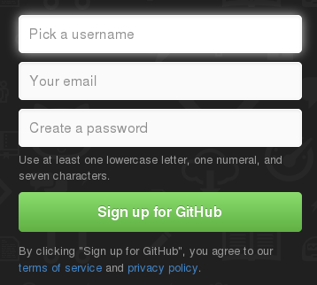

# Introducción

## Objetivos

* Saber qué es el Software Libre
* Aprender qué es un Sistema de Control de Versiones
* Ver los Sistema de Control de Versiones y sus tipos
* Conocer las principales características de git

## Software Libre

En los últimos años, el software libre se ha ido extendiendo hasta abarcar la mayor parte de sistemas de Internet, supercomputadores o servicios de red, llegando finalmente a ordenadores personales, tablets, teléfonos e incluso electrodomésticos.

Llamamos [Software Libre](http://es.wikipedia.org/wiki/Software_libre) al que permite al usuario ejercer una serie de libertades, a saber:

* la libertad de usar el programa, con cualquier propósito.
* la libertad de estudiar cómo funciona el programa y modificarlo, adaptándolo a tus necesidades.
* la libertad de distribuir copias del programa, con lo cual puedes ayudar a tu prójimo.
* la libertad de mejorar el programa y hacer públicas esas mejoras a los demás, de modo que toda la comunidad se beneficie.

Para que un programa sea libre hacen falta dos requisitos fundamentales:

* Una licencia que permita el uso, modificación y distribución del programa.
* Acceso al código fuente del programa.

Además, en la comunidad de software libre se dan algunas peculiaridades, como la internacionalización o el trabajo colaborativo de gran cantidad de desarrolladores, que han promovido la creación de forjas, repositorios y sistemas que permitan compartir ese código de forma abierta y además, administrar y gestionar todo ese trabajo de una forma eficiente.

git es uno de estos sistemas, y es software libre.

## Sistemas de control de Versiones

En cualquier proyecto de desarrollo es necesario gestionar los cambios, modificaciones, añadidos etc. que se han hecho a lo largo de la historia de dicho proyecto.

Si se trata de un trabajo pequeño, de corta duración y es llevado a cabo por un solo programador, quizás un archivo histórico de copias de seguridad pueda ser suficiente, pero esto se vuelve claramente insuficiente al crecer la complejidad del proyecto.

Algunos de los problemas más habituales a los que se enfrenta cualquier persona que participe en un desarrollo informático son:

* Dos o más programadores modifican el mismo archivo de código y hay que gestionar ese conflicto.

* Es necesario mantener (al menos) dos versiones del proyecto, una en producción y otra en desarrollo.

* Algún cambio ha sido desechado y es necesario regresar a una fase anterior del proyecto.

* Se inicia un "fork" o proyecto derivado a partir del estado actual del proyecto.

Llevar a cabo la administración de estos aspectos (y de muchos otros) manualmente es materialmente imposible, y es para ello para lo que se inventaron los Sistemas de Control de Versiones.

Debido al crecimiento en extensión y complejidad del software los Sistemas de Control de Versiones están tomando cada vez más importancia. En especial, los proyectos de software libre, que tienden a aunar los esfuerzos de un gran número de programadores trabajando simultáneamente en múltiples versiones del código, han estado a la vanguardia del uso de estas herramientas.

Estos sistemas nacieron para gestionar código fuente, pero pueden ser usados para cualquier tipo de documentación (aunque no pueden aprovechar todo su potencial en archivos que no sean de texto plano). Por ejemplo, este curso ha sido desarrollado bajo git y su código puede encontrarse en su repositorio oficial en [github.com/oslugr/curso-git](https://github.com/oslugr/curso-git)

##Tipos de Sistemas de Control de Versiones

Existen muchos Sistemas de Control de Versiones como [CVS](http://es.wikipedia.org/wiki/CVS), [Subversion](http://es.wikipedia.org/wiki/Subversion), [Bazaar](http://es.wikipedia.org/wiki/Bazaar_(software)), [Mercurial](http://es.wikipedia.org/wiki/Mercurial) o, por supuesto, [Git](http://es.wikipedia.org/wiki/Git), pero todos pueden clasificarse en dos tipos fundamentales según su modo de trabajo.

###Sistemas centralizados

Los sistemas de control de versiones centralizados fueron los primeros en aparecer y son los de funcionamiento más simple e intuitivo.

En ellos, existe un repositorio central donde se archiva el código y toda la información asociada (marchas de tiempo, autores de los cambios, etc). Los distintos desarrolladores trabajan con copias de ese código que actualizan a partir del servidor central, a donde también envían sus cambios.

Es decir, la versión "oficial" de referencia es la que hay en ese repositorio, y todos los programadores sincronizan sus versiones con esa.

Los programas más conocidos de este tipo son CVS y Subversion.

###Sistemas distribuidos.

Los sistemas distribuidos son más complejos, pero a cambio ofrecen una mayor flexibilidad.

En estos sistemas no existe un servidor central, sino que cada programador tiene su propio repositorio que puede sincronizar con el de cada uno de los demás.

Hay que hacer notar que, aunque no es necesario en este tipo de arquitectura, en la práctica se suele definir un repositorio de referencia para albergar la versión "oficial" del software.

Los sistemas distribuidos más conocidos son Bazaar y, por supuesto, git.

##git

Git nació para ser el Sistema de Control de Versiones del kernel de Linux (de hecho, fue originalmente programado por el mismo *Linus Torvalds*) y por ello está preparado para proyectos grandes, con muchos desarrolladores y un gran número de ramas.

Se trata, como ya hemos dicho, de un Sistema de Control de Versiones distribuido, por lo que cada programador cuenta con su propio repositorio. Esto hace que, salvo cuando llega el momento de sincronizar con otro repositorio, todo el trabajo se haga en local, con ventajas como la velocidad o que se pueda trabajar sin acceso a la red.

git es software libre, y su código está disponible en su [repositorio de GitHub](http://github.com/git/git); el sitio oficial de git es [git-scm.com](http://git-scm.com/). Git es también multiplataforma y existen versiones para Linux, Mac, Windows y Solaris.

En este curso se usará Linux para los ejemplos y referencias y se recomienda encarecidamente su uso. Otros sistemas operativos no están tan preparados para algunas tareas como administrar sesiones remotas, etc.

En cualquier caso, el uso del propio git en todos ellos es similar por lo que, salvo las particularidades y limitaciones que pueda tener cada uno, no hay ningún problema a la hora de seguir este curso desde otro sistema operativo.

## Abrir una cuenta en Github

Más adelante en este curso se hablará de Github y se darán detalles sobre su uso; por ahora, será suficiente para nosotros con saber abrir una cuenta (que usaremos para enviar nuestros ejercicios).

Desde la propia [página principal de la web de GitHub](https://github.com/) y como cualquier otro registro, se nos solicitan sólo tres datos: nombre o nick, e-mail y contraseña:

