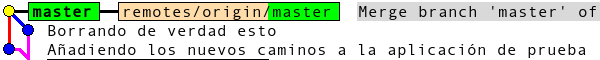
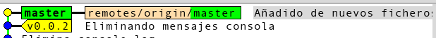
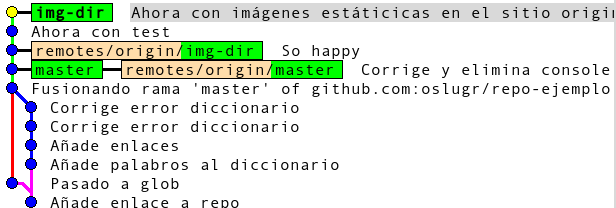
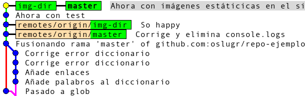
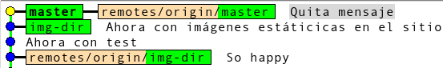
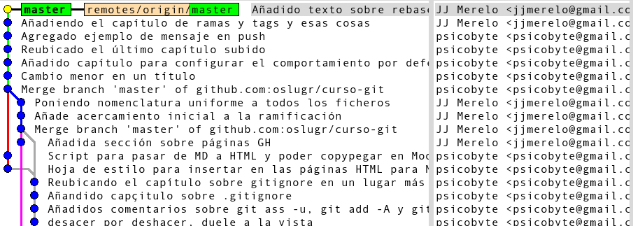
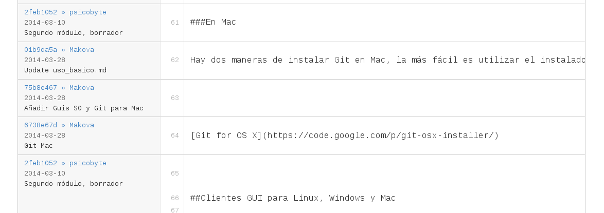

## Más usos de `git`

### Objetivos

* Aprender patrones habituales de flujo de trabajo con `git`
* Aprender a trabajar con las ramas.
* Solucionar los conflictos cuando dos desarrolladores trabajan sobre la misma línea.
* Interpretar la historia en sus diferentes formatos

### Flujos de desarrollo de software (y quizás de otras cosas)

Un sistema como `git` no es independiente de una organización del
trabajo. Aunque a priori puedes trabajar como te dé la gana, el que te
facilite el uso de ciertas herramientas hace que sea más fácil usar
una serie de prácticas que son habituales en el desarrollo de software
(y de otras cosas, como documentación o novelas) para hacer más
productivos a los equipos de trabajo y poder predecir con más
precisión el desarrollo de los mismos. Por eso, aunque se puede usar
cualquier metodología de desarrollo de software con el mismo, `git`
funciona mejor con
[metodologías ágiles](http://es.wikipedia.org/wiki/Desarrollo_%C3%A1gil_de_software)
que tienen ciclos más rápidos de producción y de despliegue de nuevas
características o de arreglo de las mismas. Las metodologías ágiles
son iterativas y en todas las iteraciones están presentes la mayoría
de los actores del desarrollo: clientes, desarrolladores, arquitectos;
incluso en algunas puede que esté la peña de márketing, a ver si se
enteran de lo que está haciendo el resto de la empresa para venderlo
(y no al revés, vender cosas que luego obligan al resto de la empresa
a desarrollar).

El desarrollo se divide por tanto en estas fases

1. Trabajo con el código. Modificar ficheros, añadir nuevos.
2. Prueba del código. La mayor parte de las metodologías de desarrollo
hoy en día, o todas, incluyen una parte de prueba; en casi todos los
casos esta prueba está automatizada e incluye test unitarios (que
prueban características específicas), de integración y de cualquier
otro tipo (calidad de código, existencia y calidad de la
documentación). 
3. Lanzamiento del producto. Cuando se han incorporado todas las
características que se desean, se lanza el producto. El lanzamiento
del producto, en el caso de web, incluye un *despliegue* (*deploy*)
del mismo, y en el caso de tratarse de otro tipo de aplicación, de un
*empaquetamiento*. Se suele hablar, en todo caso, de *despliegue*
(aunque sea porque las aplicaciones web son más comunes hoy en día que
las aplicaciones de escritorio).
4. Resolución de errores con el código en producción. Si surge algún
error, se trata de resolver sobre la marcha (*hotfix*), por supuesto,
incorporándolo al código que se va a usar para desarrollos posteriores.

En casi todas estas fases puede intervenir, y de hecho lo hace, un
sistema de control de fuentes como git; en muchos casos no se trata de
órdenes de `git`, sino de funciones a las que se puede acceder
directamente desde sitios de gestión como GitHub.

### Organización de un repositorio de git

No hay reglas universales para la organización de un repositorio,
aunque sí reglas sobre como *no* debe hacerse: todo en un único
directorio. El repositorio debe estar organizado de forma que cada
persona sólo tenga que *ver* los ficheros con los que tenga que
trabajar y no se *distraiga* con la modificación de ficheros con los
cuales, en principio, no tiene nada que ver; también de forma que no
se sienta tentado en modificar esos mismos ficheros. Vamos a exponer
aquí algunas prácticas comunes, pero en cada caso el sentido común y la
práctica habitual de la empresa deberá imponerse...

#### Qué poner en el directorio principal

Cuando se crea un repositorio en GitHub te anima a crear un
`README.md`. Es importante que lo hagas, porque va a ser lo que se
muestre cuando entres a la página principal del proyecto en GitHub y,
además, porque te permite explicar, en pocas palabras, de qué va el
proyecto, cómo instalarlo, qué prerrequisitos tiene, la licencia, y
todo lo demás necesario para navegar por él. 

Otros ficheros que suelen ir en el directorio principal

* `INSTALL` por costumbre, suele contener las intrucciones para
  instalar. También por convención, hoy en día se suele escribir
  usando Markdown convirtiéndose, por tanto, en `INSTALL.md`.
  
 * `.gitignore` posiblemente ya conocido, incluye los patrones y
   ficheros que no se deben considerar como parte del repositorio
   
 * `LICENSE` incluye la licencia. También se crea automáticamente
   desde GitHub en caso de que se haya hecho así. No hay que
   olvidar que también hay que incluir una cabecera en cada fichero
   que indique a qué paquete pertenece y cuál es la licencia.
   
 * `TODO` es una ventana abierta a la colaboración, así como una lista
   para recordarnos a nosotros mismos qué tareas tenemos por delante.
   
 * Otros ficheros de configuración, como `.travis.yml` para el sistema
   de integración continua Travis, `Makefile.PL` o `configure` u otros
   ficheros necesarios para configurar la librería, y ficheros
   similares que haga falta ejecutar o ver al instalar la
   librería. Se aconseja siempre que tengan los nombres que suelan ser
   habituales en el lenguaje de programación, si no el usuario no
   sabrá como usarlos. 
   
 En general se debe tratar de evitar cargar demasiados ficheros, fuera
 de esos, en el directorio principal. Siempre que se pueda, se usará
 un subdirectorio.
 
#### Una estructura habitual con directorio de test
 
 Los fuentes del proyecto deben ir en su propio directorio, que
 habitualmente se va a llamar `src`. Algunos lenguajes te van a pedir
 que tengan el nombre de la librería, en cuyo caso se usará el que más
 convenga. Si no se trata de una aplicación sino de una biblioteca, se
 usará `lib` en vez de `src`, como en esta [biblioteca llamada *NodEO*](https://github.com/JJ/nodeo)
 Los tests unitarios irán aparte, en un directorio
 habitualmente llamado `test`. Finalmente, un directorio llamado
 `examples` o `apps` o `scripts` o `bin` o `exe` incluirá ejemplos de uso de la
 biblioteca o diferentes programas que puedan servir para entender
 mejor la aplicación o para ejecutarla directamente.
 
 
#### Estructura jerárquica con submódulos
 
 Un repositorio `git` tiene una estructura `plana`, en el sentido que
 se trata de un solo bloque de ficheros que se trata como tal, a
 diferencia de otros sistemas de gestión de fuentes centralizados como
 CVS o Subversion en los que se podía tratar cada subdirectorio como
 si fuera un proyecto independiente. Pero en
 algunos casos hace falta trabajar con proyectos en los cuales haya un
 repositorio que integre el resultado del desarrollo independiente de
 otros, por ejemplo, una aplicación que se desarrolle conjuntamente
 con una librería. En ese caso un repositorio `git` se puede dividir
 en
 [submódulos](http://git-scm.com/book/en/Git-Tools-Submodules),
 que son básicamente repositorios independientes pero que están
 incluidos en una misma estructura de directorios.
 
 Por ejemplo, vamos a incluir el texto de este curso en el repositorio
 de ejemplo, para poder servirlo como una web también:
 

```
git submodule add git@github.com:oslugr/curso-git.git curso
Clonar en «curso»...
remote: Reusing existing pack: 14, done.
remote: Counting objects: 4, done.
remote: Compressing objects: 100% (4/4), done.
remote: Total 18 (delta 0), reused 0 (delta 0)
Receiving objects: 100% (18/18), 17.26 KiB, done.
Resolving deltas: 100% (4/4), done.
```

Los submódulos no se clonan directamente al clonar el repositorio. Hay
que dar dos comandos: `git submodule init` y `git submodule update`
dentro del directorio correspondiente; esta última orden servirá para
actualizar submódulos también cada vez que haya un cambio en el repo
del que dependan (y queramos actualizar nuestra copia); tras ellos
habrá que decir `git pull`, como siempre, para  traerse
los ficheros físicamente. 

De esta forma, el repositorio queda (parcialmente) con esta estructura
de directorios:

```
jmerelo@penny:~/txt/docencia/repo-tutoriales/repo-ejemplo$ tree
.
├── curso
│   ├── LICENSE
│   ├── README.md
│   └── texto
│       ├── ganchos.md
│       ├── GitHub.md
│       └── mas-usos.md
```


con el subdirectorio `curso` siendo, en realidad, otro repositorio.

Por ejemplo, podíamos tener una estructura que incluyera
subdirectorios para `cliente` (un submódulo) y `servidor` (otro
submódulo). Con ambos se puede trabajar de forma independiente y, de
hecho, *residen* en repositorios independientes, pero puede que, en
caso de empaquetarlos o desplegarlos de alguna forma determinada (por
ejemplo, a un PaaS), queramos hacerlo desde un solo repositorio, como
en este caso.

Los submódulos pueden ser un ejemplo de flujos de trabajo: en este
caso, hay un flujo desde "las fuentes del manantial" (que puede
cambiar de forma independiente su proyecto) hasta "la desembocadura"
(nuestro proyecto, que lo usa). Dividir un proyecto en módulos y dejar
que personas independientes se encarguen de cada uno, integrándolo
todo en un submódulo, por tanto, es una forma simple y sin demasiadas
complicaciones de hacerlo. 

### Flujos de trabajo con git

Un *flujo de trabajo* es simplemente una forma de organizar las tareas
de programación de forma que se conozca, de antemano, qué tareas van
detrás de qué tareas y cuál es el destino, en cada momento, del código
que se está haciendo. El tener un flujo de trabajo consistente hace
que se eviten conflictos y también que el resultado del trabajo sea
más predecible; también a evitar problemas y a identificarlos
fácilmente. 

El flujo de trabajo básico, de un solo usuario, cuando se trabaja con un sistema de control
de fuentes y lo hace un solo usuario es el siguiente:

1. `git pull`
2. Trabajo con el código; añadir nuevos ficheros fuentes con `git add`
3. `git commit -a -m "[implícito: este commit] [hace] [Tal cosa]" (o
`git -am`, que es lo mismo)
4. `git push`

Fijémonos en el tercer paso, el commit. Primero, conviene hacer siempre `-a`,
es decir, `-all`
por [varias razones](http://git-scm.com/docs/git-commit):

1. Porque examina todos los ficheros que están siendo seguidos, no
sólo los del directorio actual y los que hay por debajo.
2. Porque [hace automáticamente un `git rm` sobre los mismos](http://stackoverflow.com/questions/3541647/git-add-vs-git-commit-a), si es que
ha sido borrados. 

Lo segundo es decidir cuando se hace el *commit*; lo habitual es que se
haga cada vez que se lleve a cabo un cambio significativo, pero ¿qué
es un cambio significativo? Pues un cambio más o menos atómico, que
incluya todos los ficheros afectados por ese cambio y, lo más
importante, que deje, a priori, el código en un estado *sano*. No se
debe hacer commit de un código sintácticamente incorrecto, dejarse a
medias un cambio o, en general, antes de acabar lo que quiera que uno
se propusiera hacer al empezar la sesión de trabajo. No es
imprescindible hacer un `push` por cada commit, pero tampoco estorba
hacerlo, sobre todo por si, simultáneamente, alguien está modificando
el mismo código.  

También conviene escribir `-m` para insertar el mensaje directamente
sin que salga el editor de textos (que puede que no sea nuestro editor
favorito). En el mensaje podemos escribir cualquier cosa, pero hay que
tener en cuenta que lo que escribamos es un predicado cuyo sujeto son
los cambios que hemos hecho. Sobre qué hay que escribir hay
[muchas versiones](http://tbaggery.com/2008/04/19/a-note-about-git-commit-messages.html),
pero conviene que el mensaje sea informativo, hable de por qués y de
cómos más que de qués (no se puede decir "inserta una función", eso ya
se ve en el código, sino por qué se inserta esa función) y se aconseja
también un formato similar al siguiente

    Hace tal cosa arreglando el error en el issue #666

    Siguiendo la sugerencia de @foodev hemos usado el algoritmo
    Vicentico para resolver ese error y ha quedado monísimo. 
	
Este formato se denomina `50+72` y consiste en usar una primera línea
con 50 caracteres (justos, en este caso) que incluya una explicación
extendida que esté formateada en líneas de 72 caracteres. Esto es
difícil de hacer desde la línea de órdenes, así que tienes dos
opciones: usar un *script* que formatee este mensaje, o bien
configurar tu editor de forma que use ese formato. 

El mensaje de *commit* también admite markdown y de hecho se
formateará de esa forma en GitHub (posiblemente también en otros
repos) y dentro del mismo admite ciertos atajos como referirse a una
tarea o *issue* por el número de la misma o a un desarrollador por el
handle. En todo caso, se formatee o no de esa forma, es informativo
saber por qué hace lo que hace.

En cuanto al `push` es un evento diferente que el `commit` y hace más
cosas, por lo que no debe verse como algo automático tras el
mismo. Un `commit` es una unidad mínima de cambio, un `push` envía los
contenidos al repo remoto y activa una serie de actividades, como la
integración continua, comprobación de código y otra serie de cosas
interesantes. Además, hasta que no hacemos `push` no comparamos
nuestro código con el que está en `HEAD`, que en ese momento puede
estar más adelante o más atrás. Si tienes miedo de provocar un
conflicto o de que te lo provoque, no hagas un pull hasta estar seguro
de que el código no rompe los tests automáticos y hasta que estés
seguro de poder resolver los conflictos que ocurran.  ¿Cómo se pueden
resolver estos conflictos? Lo veremos a continuación. 

Igual que en el caso de los submódulos, no deja de ser simplemente una
rutina de trabajo más que un flujo de trabajo si trabaja uno
solo. Veremos cómo trabajar en diferentes ramas evitando conflictos.

### Ramas

Las *ramas* son una característica de todos los sistemas de control de
fuentes. A todos los efectos, una rama es un proyecto diferente que
*surge* de un proyecto principal, aunque nada obliga a que contengan
nada en común (por ejemplo, un repositorio puede incluir el código y
las páginas web como una rama totalmente diferente). Sin embargo, las
ramas, que más bien deberían llamarse *ramificaciones* o *caminos*,
son *caminos divergentes* a partir de un tronco común que,
eventualmente, pueden combinarse (aunque no es obligatorio) en uno
solo. En la práctica y como
[dicen aquí](http://longair.net/blog/2009/04/16/git-fetch-and-merge/)
una rama es un nombre para un *commit* específico y todos los commits
que son antecesores del mismo. 

En `git` las ramas son también parte natural del desarrollo de un
proyecto, dado que se trata de un sistema de control de fuentes
distribuido. Cada usuario trabaja en su propia rama, que se *fusiona*
con la rama principal en el repositorio compartido cuando se hace
*push*. Por eso en alguna ocasión puede suceder que, cuando se hace
*pull* o incluso *push*, si se encuentra que las ramas que hay en el
repo con el que se fusiona y localmente contienen diferente número de
*commits*, aparecerá un mensaje que te indicará que se está fusionando
con la rama principal; todo esto, incluso aunque no se hayan creado
ramas explícitamente. En realidad, *pull* es combinación de dos
operaciones: `fetch` y `merge`, como ya se ha visto en
[el capítulo de uso básico](uso_basico.md). De hecho
[hay quien dice que no debe usarse nunca pull](http://longair.net/blog/2009/04/16/git-fetch-and-merge/).

Por ejemplo, en caso de que se haya borrado un fichero (o, para el
caso, hecho cualquier cambio) en un repositorio y se trate de hacer
`push` desde el local, habrá un error de este estilo. 

```
To git@github.com:oslugr/repo-ejemplo.git
 ! [rejected]        master -> master (non-fast-forward)
error: failed to push some refs to 'git@github.com:oslugr/repo-ejemplo.git'
consejo: Updates were rejected because the tip of your current branch is behind
consejo: its remote counterpart. Merge the remote changes (e.g. 'git pull')
consejo: before pushing again.
consejo: See the 'Note about fast-forwards' in 'git push --help' for details.
```

En este caso habrá dos ramas, en la *punta* de cada una de las cuales
habrá un commit diferente. Se siguen instrucciones, es decir, `git
pull`

```
jmerelo@penny:~/txt/docencia/repo-tutoriales/repo-ejemplo$ git pull
remote: Counting objects: 2, done.
remote: Compressing objects: 100% (2/2), done.
remote: Total 2 (delta 0), reused 0 (delta 0)
Unpacking objects: 100% (2/2), done.
De github.com:oslugr/repo-ejemplo
   61253ec..2fd77db  master     -> origin/master
Eliminando Makefile
Merge made by the 'recursive' strategy.
 Makefile | 3 ---
 1 file changed, 3 deletions(-)
 delete mode 100644 Makefile
```

y aparece, efectivamente, el directorio borrado. Habrá que hacer el
push de nuevo. Una vez hecho, el repositorio se ha estructurado como
se muestra en la imagen:


Esta imagen, que
[se puede ver también en GitHub con fecha 2 de abril](https://github.com/oslugr/repo-ejemplo/network),
y que está obtenida del programa cliente `gitk`, muestra cómo se ha
producido la fusión. La que aparece más cerca de
la fusión es la que se hizo inicialmente, borrando el fichero, y la
más alejada, que aparece más a la izquierda, es la hecha a
continuación. El último *commit* fusiona las dos ramas y crea una sola
dentro de la rama principal.

Por eso hablamos de enramamiento (bueno, debería ser ramificación,
pero esto suena mejor) *natural* en `git`, porque se produce
simplemente por que haya dos *commits* divergentes que procedan de la
misma rama. Sin embargo, se pueden usar ramificaciones adrede y es lo
que veremos a continuación. 

#### Ramas *ligeras*: etiquetas

Una *etiqueta* permite *guardar* el estado del repositorio en un
momento determinado, siendo como una especie de *foto* del estado el
proyecto. Se suele asociar a hitos en la historia del mismo: entrada
en producción, despliegue de los resultados, o versión mayor o menor. 

Para [etiquetar](http://git-scm.com/book/en/Git-Basics-Tagging) se usa
la orden `tag`

	git tag v0.0.2
	
`tag` etiqueta el último *commit*, es decir, asigna una etiqueta al
estado en el que estaba el respositorio tras el último commit. La
etiqueta aparecerá de forma inmediata (sin necesidad de hacer *push*,
puesto que se añade al último commit y se puede listar con

```
git tag
jmerelo@penny:~/txt/docencia/repo-tutoriales/repo-ejemplo$ git tag
v0.0.1
v0.0.2
```



Como se ve, una etiqueta es, en realidad, un apodo para un commit
determinado cuyo *hash* puede ser difícil de recordar. Pero por esa
misma razón se pueden usar como salvaguarda del estado del repositorio
en un momento determinado que, más adelante, se puede recuperar o
fusionar con una rama.

Las ramas se pueden también anotar, lo que añade una explicación
adicional a lo que ya esté almacenado en el commit correspondiente. 
	
	git tag -a v0.0.2.1

abrirá un editor (el que tengamos especificado por defecto) para
añadir una anotación a esta etiqueta, lo que nos podemos ahorrar si
usamos

	git tag -a v0.0.2.1 -m "Estado estacionario del repositorio"
	
por ejemplo. Esta información aparecerá añadida al commit
correspondiente (el último que hayamos hecho) cuando hagamos, por
ejemplo, `git show v0.0.2.1` 

```
tag v0.0.2.1
Tagger: JJ Merelo <jjmerelo@gmail.com>
Date:   Sun Apr 6 09:58:12 2014 +0200
Poco antes de pasar a producción el tema de tags
en realidad, sólo es un ejemplo
commit b958b16b8261fa3ca8159b3ae45e237ae1fa1dce
Author: JJ Merelo <jjmerelo@gmail.com>
Date:   Sun Apr 6 09:45:38 2014 +0200
    Añadido de nuevos ficheros al servidor
    Y edición del README para que sirva para algo
```

(Suprimidos espacios en blanco para que aparezca como un solo
mensaje). Que, como se ve, añade un pequeño mensaje (al principio) al
propio del commit (a continuación). 

Finalmente, `git describe` es una orden creada precisamente para
trabajar con las etiquetas: te indica el camino que va desde la última
etiqueta al commit actual o al que se le indique

```
git describe
v0.0.2.1-1-g6dd7a8c
```

que, de una forma un tanto críptica, indica que a partir de la
etiqueta `v0.0.2.1` hay un commit `-1-` y el nombre del último objeto,
en este caso el único, `6dd7a8c`. Es otra forma de
[*etiquetar* un punto en la historia de una rama](http://gitfu.wordpress.com/2008/05/25/git-describe-great-another-way-to-refer-to-commits/),
o simplemente otra 
forma de llamar a un commit. Es más descriptivo que simplemente el
hash de un commit en el sentido que te indica de qué etiqueta has
partido y lo lejos que estás de ella.

Por eso precisamente conviene, como una buena práctica, etiquetar la
rama principal con estas *ramas ligeras* cuando suceda un hito
importante en el desarrollo. Y también conviene recordar que, dado que
son anotaciones locales,
[hay que hacer explícitamente `git push --tags`](http://alblue.bandlem.com/2011/04/git-tip-of-week-tags.html)
para que se comuniquen al repositorio remoto. 

#### Creando y fusionando ramas

Ya que hemos visto como se crean ramas de forma implícita y de forma
*ligera* (con etiquetas), vamos a trabajar explícitamente con
ramas. La [forma más rápida de crear una rama](http://git-scm.com/book/es/Ramificaciones-en-Git-Procedimientos-b%C3%A1sicos-para-ramificar-y-fusionar) es usar 

```
git checkout -b get-dir
Switched to a new branch 'get-dir'
```

Esta orden hace dos cosas: crea la rama, copia todos los ficheros en
la rama en la que estemos (que será la `master` si no hemos hecho
nada) a la nueva rama y te cambia a la misma; a partir de ese momento
estarás modificando ficheros en la nueva rama. Es decir, equivale a
dos órdenes

```
	git branch get-dir
	git checkout get-dir 
```

En esta rama se puede hacer lo que se desee: modificar ficheros,
borrarlos, añadirlos o hacer algo totalmente diferente. 

>Un cambio de rama sobreescribirá los cambios que se hayan hecho a los
> ficheros sin hacer *commit*. Si existen tales cambios te avisará,
> pero puede que no quieras usar el *commit* para comprometer cambios
> y dejar el repositorio en un estado incorrecto; en ese caso se puede
> usar simplemente
> [`git stash`](http://git-scm.com/book/en/Git-Tools-Stashing)  que almacena los cambios en un fichero
> temporal que se puede recuperar más adelante usando `git stash apply
> --index`. 


En todo
momento 

```
git status

# En la rama get-dir
```

nos dirá en qué rama estamos; los ficheros que físicamente
encontraremos en el directorio de trabajo serán los correspondientes a
esa rama. Conviene hacer siempre `git status` al principio de una
sesión para saber dónde se encuentra uno para evitar cambios y sobre
todo pulls sobre ramas no deseadas.

La rama que se ha creado sigue siendo rama local. Para crear esa rama
en el repositorio remoto y a la vez sincronizar los dos repositorios
haremos

```
	git push --set-upstream origin get-dir
```

donde `get-dir` es el nombre de la rama que hemos creado. Esta orden establece un origen por defecto (*upstream*) para la rama en la que estamos y además le asigna un nombre a esa rama, get-dir. 

Las ramas de
trabajo se pueden listar con

```
	git branch
 * get-dir
   master
```

con un asterisco diciéndonos en qué rama concreta estamos; si
queremos ver todas las que tenemos se usa

```
	git branch --all
 * get-dir
   master
  remotes/heroku/master
  remotes/origin/HEAD -> origin/master
  remotes/origin/get-dir
  remotes/origin/master
```

que, una vez más, nos muestra con un asterisco que estamos trabajando
en la rama local `get-dir`; a la vez, nos muestra todas las ramas
remotas que hay definidas y la relación que hay con las locales, pero
más que nada por nombre. Si queremos ver la relación real entre ellas
y los commits que hay en cada una

```
jmerelo@penny:~/txt/docencia/repo-tutoriales/repo-ejemplo$ git branch -vv
 * get-dir 389b383 [origin/get-dir] Pasado a glob
   master  1a93e3d [origin/master] Añade palabros al diccionario
```

con `-vv` indicando doble verbosidad, es decir, que imprima toda la información que tenga. 

En este ejemplo se ha mostrado un patrón habitual de uso de las ramas:
para probar nuevas características que no sabes si van a funcionar o
no y que, cuando funcionen, se pasan a la rama principal. En este caso
se trataba de trabajar con *todos* los ficheros del directorio en vez
de los ficheros que le pasemos explícitamente. Estas ramas se suelen
denominar
[*ramas de características* o *feature branches* y forman parte de un flujo de trabajo habitual en git](https://www.atlassian.com/es/git/workflows#!workflow-feature-branch). Sobre
un repositorio central se creará una rama si quieres probar algo que
no sabes si estará bien eventualmente o si realmente será util. De
esta forma no se *estorba* a la rama principal, que puede estar
desarrollando o arreglando errores por otro lado. En este flujo de
trabajo, eventualmente se integra la rama desarrollada en la
principal, para lo que se usa pull de nuevo. El concepto de `pull` es
usar primero `fetch` (descargarse los cambios al árbol) y
posteriormente `merge` (incorporar los cambios del árbol al
índice). En casos complicados esta división te da flexibilidad para
escoger qué cambios quieres hacer, pero en un flujo de trabajo como
este se puede usar simplemente. Supongamos, por ejemplo, que estamos
en la rama `get-dir` y se han hecho cambios en la rama principal.

```
jmerelo@penny:~/txt/docencia/repo-tutoriales/repo-ejemplo$ git pull origin master
  De github.com:oslugr/repo-ejemplo
  * branch            master     -> FETCH_HEAD
  Merge made by the 'recursive' strategy.
 .aspell.es.pws | 3 +++
 README.md      | 5 +++--
 2 files changed, 6 insertions(+), 2 deletions(-)
```

Este mensaje te muestra que se ha fusionado usando una estrategia
determinada. `git` examina los commits que diferencian una rama de la
otra y te los aplica; al hacer `pull` aparecerá el editor, en el que
pondremos el mensaje de fusión. Los cambios se propagarán a la rama
remota haciendo `git push` y las ramas quedarán como aparece en
[la visualización de la red con fecha 6 de abril de 2014](https://github.com/oslugr/repo-ejemplo/network);
`master` se ha fusionado con `get-dir`. 

También podemos hacer la operación inversa. Visto que los cambios de
`master` no afectan a la funcionalidad nueva que hemos creado,
fusionemos la rama `get-dir` en la principal. Cambiamos primero a ésta

    git checkout master
	
`git checkout` *saca* del árbol los ficheros correspondientes (lo que
puede afectar a los editores y a las fechas de los mismos, que
mostrarán la del último checkout si no se han modificado) y nos
deposita en la rama principal, desde la cual podemos fusionar, usando
también pull

```
jmerelo@penny:~/txt/docencia/repo-tutoriales/repo-ejemplo$ git pull origin get-dir
De github.com:oslugr/repo-ejemplo
 * branch            get-dir    -> FETCH_HEAD
Updating df46a37..3705af0
Fast-forward
 package.json |  5 +++--
 web.js       | 18 ++++++++++++------
 2 files changed, 15 insertions(+), 8 deletions(-)
```

que, dado que no hemos hecho ningún cambio en el mismo fichero,
fusiona sin más problema la rama. En caso de que se hubiera modificado
las mismas líneas, es decir, que los *commits* hubieran creado una
divergencia, se habría provocado un conflicto que se puede solucionar
como se ha visto en el apartado correspondiente. Pero, dado que no 
la ha habido, el resultado final será el que se muestra en el gráfico.


La rama, una vez fusionada con el tronco principal, se puede
considerar una rama muerta, así que nos la cargamos

```
jmerelo@penny:~/txt/docencia/repo-tutoriales/repo-ejemplo$ git branch -d get-dir
Deleted branch get-dir (was 3705af0).
```

Pero eso borra solamente la rama local. Para
[borrarla remotamente](http://stackoverflow.com/questions/2003505/how-do-i-delete-a-git-branch-both-locally-and-remotely):

```
jmerelo@penny:~/txt/docencia/repo-tutoriales/repo-ejemplo$ git push origin :get-dir
To git@github.com:oslugr/repo-ejemplo.git
 - [deleted]         get-dir
```

Una sintaxis con `:` que es ciertamente poco lógica, pero efectiva. Con
eso tenemos la rama borrada tanto local como remotamente.


### Los misterios del rebase

`git` tiene múltiples formas de reescribir la historia, como si de un
régimen totalitario se tratara. Una de las más simples es *aplanar* la
historia como si todos los *commits* hubieran sucedido unos detrás de
otros, en vez de en múltiples ramas como es la forma habitual de
trabajar (en un flujo de trabajo *rama por característica* como hemos
visto anteriormente). Por ejemplo, podemos crear una rama `img-dir`
(sobre el repositorio de ejemplo, añade a la aplicación de forma que
se pueda trabajar con las imágenes del tutorial) dejando el repo en el
estado que se muestra a continuación. 



tomada desde la propia rama, donde hay una rama `img-dir` con un par
de *commits* a partir del máster (dos puntitos azules más abajo).

Una vez acabado el trabajo con la rama, cambiamos a `master`(`git
checkout master`) y podemos hacer `rebase`

```	
git checkout master
Switched to branch 'master'
jmerelo@penny:~/txt/docencia/repo-tutoriales/repo-ejemplo$ git rebase img-dir
First, rewinding head to replay your work on top of it...
Fast-forwarded master to img-dir.
```

Dejando el repositorio en el estado siguiente



El último commit es ahora parte de la rama `master`. No sólo se han
fusionado los cambios en la rama principal, como se ve más abajo en la
misma imagen e hicimos con la rama creada anteriormente, `get-dir`. En
este caso, y a todos los efectos, se ha *reescrito la historia*,
pasando los commits hechos sobre la rama anterior a formar parte de la
rama principal. Una vez hecho esto, se limpia eliminando la rama
creada. Sin embargo, un rebase no elimina una rama, que sigue ahí,
sólo que en una parte diferente del árbol como se muestra a continuación



Sin embargo, ahora la rama es poco menos que un *tag* como el que
hemos visto antiguamente. No estorba así que no hace falta borrarla. 

### Quién hizo qué

Con todas estas ramificaciones es posible que, en un momento
determinado, sea difícil saber quién ha hecho qué cambio. Esto puede
ser importante no sólo para repartir las culpas cuando algo falle,
sino también para ver quién se responsabiliza de cada rama o
característica y, eventualmente, también para asignar méritos. La
herramienta `gitk` que hemos usado hasta ahora te presenta en forma de
árbol los cambios que se han venido haciendo en el repositorio, con un
panel a la derecha que muestra quién ha hecho cada commit:



En esta imagen se ve como cada commit está asignado a uno de los
autores de este tutorial, junto con los mensajes correspondientes. Con
`git log --pretty=short` se puede conseguir un efecto similar en la línea de órdenes:

```
    commit 3b89bd2fffbf7f5988de16b9911b14d70c9197bd
 Author: JJ Merelo <jjmerelo@gmail.com>
    Añadido texto sobre rebase
 commit c09756d4d296fbacd9541d2d7c23e7710a5d1f09
 Author: JJ Merelo <jjmerelo@gmail.com>
    Añadiendo el capítulo de ramas y tags y esas cosas
 commit 8e4559325032fe1425288c4d1ab51fb7072f79b1
 Author: psicobyte <psicobyte@gmail.com>
    Agregado ejemplo de mensaje en push
```

(una vez más, sin líneas en blanco), con una muestra del mensaje corto
y del commit junto con el autor. `log` es muy flexible y permite poner
cualquier tipo de formato, pero hay todavía más herramientas. `git
blame` permite hacer lo mismo sobre un fichero, viendo quién ha
modificado cada una de las líneas. Por ejemplo, `git blame
uso_basico.md` devolvería, entre otras cosas, estas líneas

```
 6017d70c (Manu      2014-03-28 22:30:40 +0100  70) [GUI Mac](http://mac.github.c
 2feb1052 (psicobyte 2014-03-10 03:35:49 +0100  71) 
 6017d70c (Manu      2014-03-28 22:30:40 +0100  72) [GUI Windows](http://windows.
 2feb1052 (psicobyte 2014-03-10 03:35:49 +0100  73) 
 01b9da5a (Manu      2014-03-28 22:36:46 +0100  74) [GUI for Linux, Windows y Mac
 75b8e467 (Manu      2014-03-28 22:29:29 +0100  75) 
 2feb1052 (psicobyte 2014-03-10 03:35:49 +0100  76) ##Empezando a usar git
```

que muestran que la línea 70 y la 71 han sido modificadas por [Manu](http://github.com/Makova)
mientras que el resto lo han sido por
[Pablo](http://github.com/psicobyte). El formato que siguen es el hash
del commit seguidos por el nombre del usuario, la fecha, el número de
línea; finalmente está el contenido de la línea. Algo un poco más
vistoso se puede ver en algunos repositorios como GitHub, pulsando
sobre el botón *Blame* que aparece en cada uno de los ficheros



Esta es simplemente una visualización del comando anterior, que
presenta además un enlace al usuario en GH en caso de serlo (porque,
recordemos, git es un DVCS cuyos cambios pueden haberse fusionado en
local por parte de cualquier tipo de usuario, que no tiene por qué
estar necesariamente en GitHub). Con `blame` se puede saber
[incluso quien modificó una línea en particular](http://stackoverflow.com/questions/5098256/git-blame-prior-commits). pero,
para un uso básico, basta lo anterior.


 


