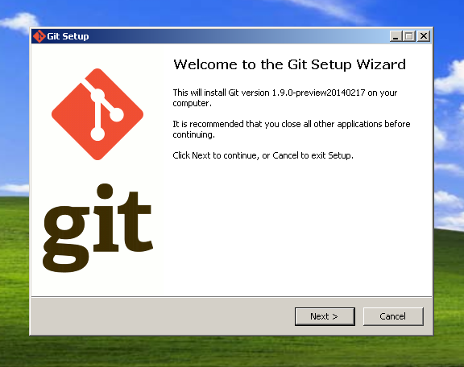
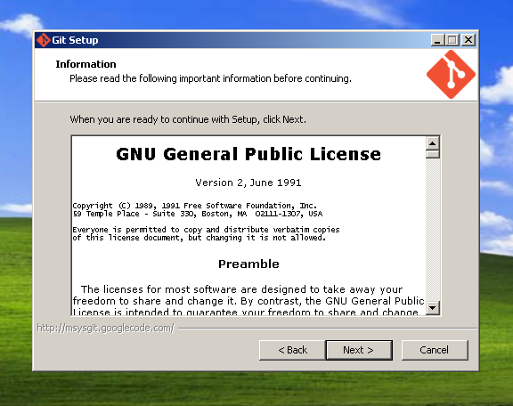
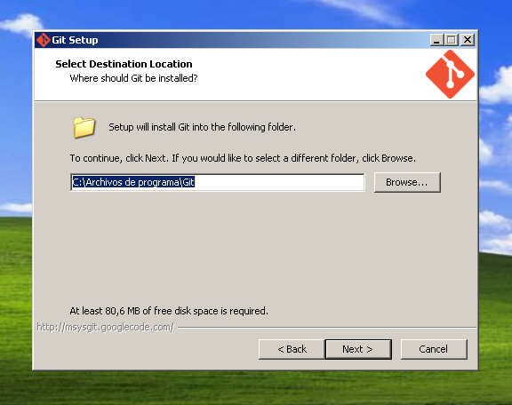
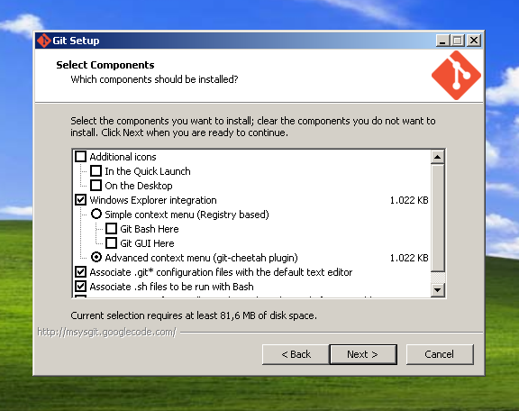
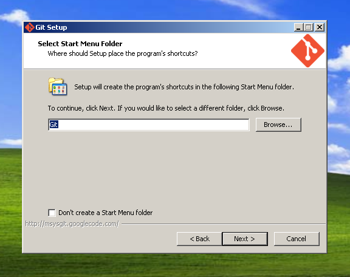
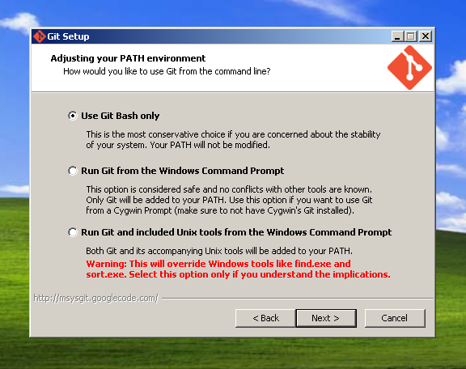
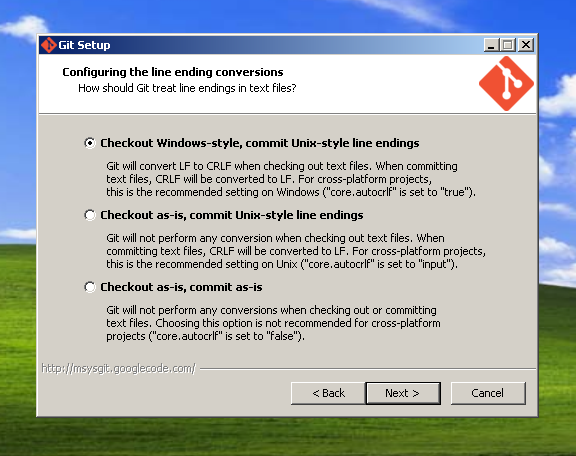
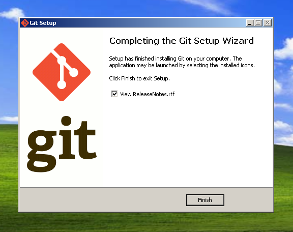
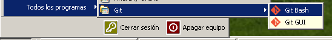
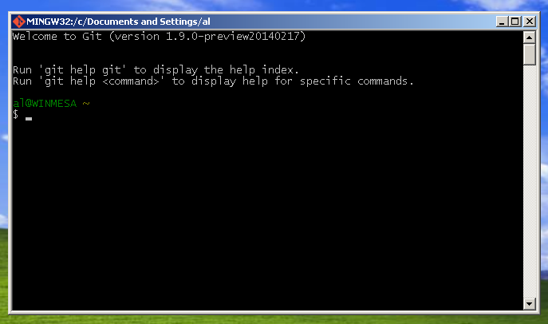

# Uso básico de git

## Objetivos

En este apartado veremos cómo se usa git de forma básica para trabajar en modo monousuario y con un repositorio centralizado.

* Instalar Git
* Crear un repositorio
* Mantener un control de cambios sobre nuestros archivos
* Sincronizar dos o más repositorios
* Tareas básicas de git

## Instalar git

`git` es software libre y se puede instalar en cualquier sistema
operativo. A continuación los más populares, empezando por el que
aconsejamos para desarrollar software en general, Linux.

###En Linux

Instalar git en Linux es tan simple como usar tu gestor de paquetes favorito. Por ejemplo (recuerda que normalmente necesitarás privilegios de *root* para instalar cualquier programa):

####En Arch Linux
`# pacman -S git`

####En sistemas Debian, Ubuntu, Mint...
`# apt-get install git`

####En Gentoo
`# emerge --ask --verbose dev-vcs/git`

####En sistemas Red Hat, Fedora:
`# yum install git`

### En Mac
Hay dos maneras de instalar Git en Mac, la más fácil es utilizar el instalador gráfico:

[Git for OS X](https://code.google.com/p/git-osx-installer/) 

### En Windows

Para instalar git en Windows debemos descargar el programa instalador en su web oficial en [http://git-scm.com/downloads](http://git-scm.com/downloads).

Una vez descargado, sólo tenemos que ejecutarlo y se abrirá una ventana que nos irá solicitando paso a paso los datos necesarios para la instalación. Pulsaremos el botón "Next" para comenzar.



Nos pasará a la página de licencia (*es una licencia libre que permite copiar, modificar y distribuir el programa*).



La siguiente es una ventana que nos permite elegir el lugar de instalación. Si no tenemos especial interés en que sea otro, el que viene por defecto está bien. 



En la siguiente, podemos elegir una serie de cosas como el que aparezcan iconos de git en Inicio Rápido y el Escritorio o tener dos nuevas órdenes en el menú contextual (*el que aparece al hacer clic derecho con el ratón en una ventana*) para iniciar una ventana de git en esa carpeta.



En la siguiente ventana se nos permite cambiar el nombre del grupo de programas que aparecerá en el menú Inicio.



Las siguientes dos opciones configuran aspectos avanzados de 'git', concretamente el uso del prompt y el manejo de retornos de carro. Para un usuario novel son adecuadas las opciones por defecto.





Y, por fin, hemos finalizado nuestra instalación.



A partir de este momento podemos ir al menú inicio como se indica en la imagen, y ejecutar "Git Bash", lo que abrirá una consola donde podremos interactuar con 'git' tal como se ve en este curso.





(*Al terminar todos estos pasos, y como se ven en la imagen, también
se instalará una versión gráfica "Git GUI", pero en este curso se
seguirá la interfaz de línea de comandos*)

>Los autores de este libro no somos partidarios del uso de Windows
> para desarrollo de software. Pero, si tienes que hacerlo porque no
> te queda otro remedio o porque te gusta, otra alternativa es usar
> [git for Windows o `msysgit`](http://msysgit.github.io/), un entorno
> completo que incluye un intérprete de órdenes y un entorno gráfico
> para trabajar desde él. 


##Clientes GUI para Linux, Windows y Mac

En este curso se seguirá la interfaz de *línea de comandos* (o *línea de órdenes*), pero existen varias aplicaciones para diversos sistemas operativos que permiten interactuar gráficamente (*Interfaz GUI*) con `git` de forma más o menos completa.

[GUI Mac](http://mac.github.com/)

[GUI Windows](http://windows.github.com/)

[GUI for Linux, Windows y Mac](http://git-scm.com/downloads/guis#"Guis clients")

##Empezando a usar git

Git es un programa en línea de comandos, y se te supone un conocimiento básico del manejo de esta (cosas como moverse por el árbol de directorios y poco más). No es necesario saber nada complejo, sólo los rudimentos básicos.

###Configurar

Lo primero que hay que hacer antes de empezar a usar git es configurar un par de parámetros básicos que nos identifican como usuario, que son nuestro correo electrónico y nuestro nombre.

Git usará estos datos para identificar nuestros aportes o modificaciones a la hora de mostrarlos en logs etc.

Configurar estos parámetros es muy fácil. Desde la línea de comandos escribimos las siguientes órdenes:

`git config --global user.name "Nombre que quieras mostrar"`

y

`git config --global user.email "correo@electroni.com"`

¿qué acabamos de hacer? Veamoslo, paso a paso:

Todos los comandos de git empiezan con la palabra `git`.

En este caso, el comando en sí mismo es `config`, que sirve para configurar varias opciones de git, en el primer caso `user.name` y en el segundo `user.email`.

Habrás notado que hay un parámetro `--global` en cada uno de los comandos. Este sirve para decirle a git que esos datos se aplican a todos los repositorios que abras.

Si quieres que algún repositorio concreto use unos datos distintos, puedes llamar al mismo comando, desde el directorio de ese repositorio, pero usando el parámetro `--local` en lugar de `--global`.

> Las opciones que configures como `--global` se almacenarán en un archivo de tu carpeta home, llamado `.gitconfig`.
> Las opciones `--local` lo harán en un archivo `config` dentro del directorio .git de tu proyecto.

Hay más opciones que se pueden configurar, puedes verlas (y ver los valores que tienen) con el comando:

`git config --list`

Si te has equivocado al escribir alguno de estos datos o quieres cambiarlo, sólo tienes que volver a ejecutar el comando correspondiente de nuevo, y sobrescribirá los datos anteriores.

Una opción de configuración muy cómoda es `git config --global color.ui true`, que hace que el interfaz de git use (si es posible) colores para resaltar distintos aspectos en el texto de sus mensajes.

###Iniciando un repositorio

Un repositorio de git no es más que un directorio de nuestro ordenador que está bajo el control de git. En la práctica, esto significa que en el directorio raíz de nuestro proyecto hay otro directivo oculto llamado ".git" donde se guardan, por ejemplo, los archivos para el control de historiales y los cambios.

Para iniciar un repositorio sólo hay que situarse en el directorio de nuestro proyecto (el que contiene o va a contener los archivos que queremos controlar) y ejecutar la siguiente orden:

`git init`

Si todo va bien, este comando responderá algo parecido a
`Initialized empty Git repository in /ruta/a/mi/proyecto/.git/`
, que significa que ya tienes creado tu primer repositorio. Vacío, pero por algo hay que empezar.

###Clonando un repositorio

Un repositorio también puede iniciarse copiando (*clonando*) otro ya existente.

`git clone REPOSITORIO`

por ejemplo:

`git clone https://github.com/oslugr/repo-ejemplo.git`

Git usa su propio protocolo "git" para el acceso remoto (también se puede clonar un repositorio local, simplemente indicando el path), pero también soporta otros protocolos como `ssh`, `http`, https...

Al contrario que con `git init`, con `git clone` no es necesario crear un directorio para el proyecto. Al clonar se creará un directorio con el nombre del proyecto dentro del que te encuentres al llamar a la orden.

Clonar un repositorio significa copiarlo completamente. No sólo los archivos, sino todo su historial, cambios realizados, etc. Es decir que en tu repositorio local tendrás exactamente lo mismo que había en el repositorio remoto de donde lo has clonado.

Si has clonado el repositorio del ejemplo anterior (y si no, hazlo ahora), podemos ver un par de cosas interesantes. ¿Recuerdas las orden `git config --list`? Entra en el directorio del repositorio (para ello tendrás que hacer algo como `cd repo-ejemplo/`) y lista las opciones de configuración.

Verás, entre otras muchas, las user.name y user.email que ya conoces. Pero hay otra que es importante, y es `remote.origin.url`, que debe contener la dirección original del repositorio del que has clonado el tuyo.

Ahora mismo no nos sirve de mucho pero, cuando más adelante trabajemos en red con otros repositorios, nos va a venir bien recordarlo.

> *IMPORTANTE*
> En adelante, a menos que se diga lo contrario, todos los comandos y órdenes que se indique se deberán ejecutar en el directorio de nuestro proyecto (o uno de sus subdirectorios, lógicamente). Git reconoce el proyecto con el que está trabajando en función del lugar donde te encuentres al ejecutar los comandos

##¿Cómo funciona git?

Antes de continuar, vamos a detenernos un momento para entender el funcionamiento de git.

Cuando trabajas con git lo haces, evidentemente, en un directorio donde tienes tus archivos, los modificas, los borras, creas nuevos, etc.

Ese directorio es lo que llamamos "Directorio de trabajo", puede contener otros directorios y, de hecho es el que contiene el directorio .git del que hablábamos al principio.

Git sabe que tiene que controlar ese directorio, pero no lo hace hasta que se lo digas expresamente.

Más adelante veremos con algo más de detalle la orden `git add`, pero ya te adelanto que lo que hace es preparar los archivos que le indiques poniéndolos en una especie de lista virtual a la que llamamos el "Index". En Index ponemos los archivos que hemos ido modificando, pero las cosas que están en el "Index" aun no han sido archivadas por git.

Ojo, que algo esté en el index no significa que se borre de tu directorio de trabajo ni nada parecido, el Index es sólo una lista de cosas que tendrás que actualizar en el repositorio porque han cambiado.

Por último, la instrucción `git commit`, que también veremos en breve, es la que realmente envía las cosas que hay en el Index al repositorio. Solo que en lugar de "repositorio" lo vamos a llamar "HEAD", porque el lugar exacto al que va puede significar cosas distintas en según que casos, como ya veremos cuando hablemos de ramas y esas cosas.

Lo sé, es todo un poco lioso ahora mismo, pero ya se irá aclarando conforme aprendamos más cosas.

Tú sólo mantén esta secuencia en la cabeza: Directorio de trabajo -> Index -> HEAD

## Manteniendo nuestro repositorio al día

Tienes tu repositorio iniciado (o clonado) con una serie de archivos con los que empiezas a trabajar, creándolos, editándolos, modificándolos, etc.

Para que git sepa que tiene que empezar a tener en cuenta un archivo (a esto se le llama *preparar* un archivo), usamos la orden `git add` de este modo:

`git add NOMBRE_DEL_ARCHIVO`

Esto, como vimos antes, añadirá el archivo indicado con `NOMBRE_DEL_ARCHIVO` al Index. No lo archivará realmente en el sistema de control de versiones ni hará nada. Sólo le informa de que debe tener en cuenta ese archivo para futuras instrucciones (que es, básicamente, en lo que consiste el Index).

Si intentas añadir al Index un archivo que no existe te dará un error.

También puedes usar *comodines*, con cosas como:

`git add miarchivo.*`

(que reconocería, por ejemplo "miarchivo.txt", "miarchivo.cosas" y "miarchivo.png")

o 

`git add miarchivo$.txt`

(que identificaría cosas como "miarchivo1.txt", "miarchivo2.txt" y "miarchivoZ.txt")

Y, en general, todos los comodines que permita usar tu sistema operativo.

Si, en lugar de un archivo, indicas un directorio, se agregarán al Index todos los archivos de ese directorio.

De este modo, la forma más fácil de agregar todos los archivos al Index es mediante la orden:

`git add .`

que añadirá el directorio en el que te encuentras y todo su contenido (incluyendo subdirectorios etc).

Un detalle importante es que, si mandas algo al Index con `git add` y luego lo modificas, no tendrás en Index la última versión, sino lo que hayas hecho hasta el momento del hacer el add.

Esto es muy útil (a veces tienes que hacer cambios que aún no quieres "archivar") pero puede llevarte a alguna confusión.

Ahora vamos a ver una orden que será tu gran amiga:

`git status`

`git status` te da un resumen de cómo están las cosas ahora mismo respecto a la versión del repositorio (concretamente, respecto al HEAD). Qué archivos has modificado, que hay en el Index, etc (también te cuenta cosas como en qué rama estás, pero eso lo veremos más adelante). Cada vez que no tengas muy claro que has cambiado y qué no, consulta `git status`.

En principio, si no has modificado nada, el mensaje básico que te da `git status` es este:

```
## On branch master
nothing to commit (working directory clean)
```

Pero, y esa es una cosa que vas a ver a menudo en git, si hay algo que hacer te informa de las posibles acciones que puedes llevar a cabo dependiendo de las circunstancias actuales diciendo como, por ejemplo, `(use "git add <file>..." to update what will be committed)`".

Cuando ya has hecho los cambios que consideres necesarios y has puesto en el Index todo lo que quieras poner bajo el control de versiones, llega el momento de "hacer commit" (también se le llama "*confirmar*"). Esto significa mandar al HEAD los cambios que tenemos en el Index, y se hace de este modo:

`git commit NOMBRE_DEL_ARCHIVO`

Como te estarás imaginando, aquí también puedes usar comodines del mismo modo que vimos en `git add`. Además, si haces simplemente

`git commit`

Esto mandará todos los cambios que tengas en el Index.

AL hacer un `commit` se abre automáticamente el editor de texto que tengas por defecto en el sistema, para que puedas añadir un comentario a los cambios efectuados. Si no añades este comentario, recibirás un error y el commit no se enviará.

> Puedes cambiar el editor por otro de tu gusto con `git config --global core.editor EDITOR`, por ejemplo:
> `git config --global core.editor vim'

Si no quieres que se abra el editor puedes añadir el comentario en el mismo commit del siguiente modo:

`git commit -m "Comentario al commit donde describo los cambios"`

Recuerda lo que dijimos antes: si modificas un archivo después de haber hecho `git add`, esos cambios no estarán incluidos en tu `commit` (si quieres incluir la última versión, no tienes más que volver a hacer `git add` antes del `commit`).

Ahora nos puede surgir un problema: Si sólo podemos confirmar con `commit` de un archivo que hayamos preparado con `add`, y sólo podemos hacer `add` de un archivo que existe en nuestro directorio de trabajo, ¿cómo le decimos a git que elimine un archivo del repositorio? Para ello tenemos la orden:

`git add -u`

que agregará al Index la información de los archivos que deben ser borrados.

Muy similar a la anterior, `git add -A` sirve para hacer `git add -u` (preparar los archivos eliminados) y `git add .` (preparar todos los archivos modificados) en una sola orden.

Un efecto parecido se puede conseguir con

`git commit -a`

Esta orden sirve para confirmar todos los cambios que haya en el directorio de trabajo *aunque no hayan sido preparados* (es decir, aunque no hayas hecho `add`). Esto incluye tanto los ficheros modificados como los eliminados, con lo que sería equivalente a hacer un `git add -A` seguido de un `git commit`.

> Esta opción ahorra escribir órdenes, pero también te da más oportunidades de meter la pata. En general se recomienda usar por separado adds y commits, convenientemente salteados de `git status` para comprobar que todo va bien.

## Sincronizando repositorios

Como sistema de control de versiones distribuido, una de las principales utilidades de git es poder mantener distintos repositorios sincronizados (es decir, que contengan la misma información), exportando e importando cambios.

> Para importar (o exportar) cambios de un repositorio remoto se necesita, lógicamente, tener acceso de lectura a ese repositorio (En sentido estricto, ya hemos importado el estado de un repositorio cuando lo clonamos al hacer `git clone`). 

Para sincronizar con uno o más repositorios remotos, debemos saber qué repositorios remotos son esos. Para ello tenemos `remote`, que se usa así:

`git remote`

Y, seguramente, te retornará algo parecido a 

`origin`

Lo que nos dice que el repositorio es el que le indicamos como "origen" al hacer el `clone` y, la verdad, no es mucha información.

Para obtener algo más útil, prueba a hacerlo con el parámetro `-v` de este modo:

`git remote -v`

lo que te retornará algo parecido a esto:

```
origin	https://github.com/oslugr/repo-ejemplo.git (fetch)
origin	https://github.com/oslugr/repo-ejemplo.git (push)
```

Esto te dice que hay un repositorio llamado "origin" que se usará tanto para recibir (fetch) como para enviar (push) los cambios. "origin" es el nombre del repositorio remoto por defecto, pero puedes tener muchos más y sincronizar con todos ellos.

Para añadir otro repositorio remoto se hace con la misma instrucción `remote` de este modo:

`git remote add ALIAS_DEL_REPOSITORIO DIRECCION_DEL_REPOSITORIO`

Donde `ALIAS_DEL_REPOSITORIO` es un nombre corto para usar en las instrucciones de git (el equivalente al "origin" que hemos visto) y `DIRECCION_DEL_REPOSITORIO` la dirección donde se encuentra. Por ejemplo:

`git remote add personal git://github.com/psicobyte/repo-ejemplo.git`

Esto añade un repositorio remoto llamado `personal` con la dirección que se indica.

Si ahora hacemos un `git remote -v`, veremos algo como:

```
personal	git://github.com/psicobyte/repo-ejemplo.git (fetch)
personal	git://github.com/psicobyte/repo-ejemplo.git (push)
origin	https://github.com/oslugr/repo-ejemplo.git (fetch)
origin	https://github.com/oslugr/repo-ejemplo.git (push)
```

Para eliminar un repositorio tienes:

`git remote rm NOMBRE`

Y para cambiarle el nombre:

`git remote rename NOMBRE_ANTERIOR NOMBRE_ACTUAL`

> Nota que git no comprueba si realmente existen los repositorios que agregas o si tienes permisos de lectura o escritura en ellos, de forma que el hecho de que estén ahí no significa que vayas a poder usarlos realmente.

###Recibiendo cambios

Ha llegado el momento de importar cambios desde un repositorio remoto. Para ello tenemos `git pull` que se usa así:

`git pull REPOSITORIO_REMOTO RAMA`

el `REPOSITORIO_REMOTO` es uno de los nombres de repositorio que hemos visto antes (si no pones ninguno, se supone "origin"). Sobre las ramas se hablará un poco más adelante, pero baste decir que, si no ponemos ninguna, se supone que es la rama "master")

de este modo, la forma más usual de llamar esta orden es, simplemente:

`git pull`

(que significaría lo mismo que `git pull origin master`).

Esta instrucción trae del repositorio remoto indicado (o de "origin" si no indicas nada, como hemos visto), todos los cambios que haya respecto al tuyo (lógicamente, no se molesta en traer los que son iguales).

Si el repositorio del que tratas de importar no existe o no tienes permiso de lectura, te dará un mensaje de error advirtiéndote de ello.

Si hay archivos que tú has modificado pero el otro repositorio no, te quedarás con los tuyos. Cuando se trate de archivos que tú no has cambiado pero que sí son distintos en el remoto, actualizarás los tuyos a este último. Pero, si importas archivos que se han modificado en ambos repositorios ¿qué pasa con las diferencias? ¿Sobrescribirá tus archivos? ¿Perderás los del otro repositorio?

Ahí es donde entra la solución de problemas, y lo veremos dentro de poco.

En realidad, `git pull` es la concatenación de dos acciones distintas, que
son `git fetch`, que trae los cambios remotos creando una nueva rama,
y `git merge`, que une esos cambios con los tuyos. En ocasiones te
convendrá más usarlas por separado pero, como aún no hemos visto el
manejo de las ramas, dejaremos esto por ahora.  

###Enviando cambios

Si con `pull` importamos cambios desde otro repositorio, la instrucción `push` es la que nos permite enviar cambios a un repositorio remoto.

Se usa de un modo bastante parecido:

`git push REPOSITORIO_REMOTO RAMA`

Igual que hemos visto con `git pull`, los valores por defecto son "origin" para el repositorio y "master" para la rama, con lo que se puede poner simplemente:

`git push`

Lo que enviará nuestros cambios al servidor remoto.

Salvo que algo haya cambiado allí.

Si la versión que hay en el servidor es posterior a la última que sincronizamos (es decir, alguien más ha cambiado algo), git mostrará un error y no nos dejará hacer el push. Antes debemos hacer un pull.

Sólo cuando hayamos hecho el pull (y resuelto los conflictos, si es que hubiera alguno), nos dejará hacer el push y enviar nuestra versión.

Al hacer tu push, git te retornará información de los cambio realizados, número de archivos, etc.

###Contraseñas

Naturalmente, como ya hemos comentado, no puedes hacer push a un repositorio en el que no tengas permiso de escritura. Para eso puede ser que sea un repositorio abierto a todo el que conozca la dirección, pero eso sería muy raro (e inseguro). Lo usual es que cuentes con un usuario y contraseña que te permitan acceder (normalmente por [ssh](http://es.wikipedia.org/wiki/Secure_Shell)) al servidor.

En otros repositorios (más raros), también necesitarás usuario y contraseña para acceder a la lectura y, por tanto, para hacer pull.

En ambos casos, git te solicitará el nombre de usuario y la contraseña cada vez que hagas push. No tiene por qué ser muy a menudo, pero puede ser un engorro.

En muchos sitios puedes ahorrarte ese trabajo usando pares de claves ssh. Básicamente consiste en que tu ordenador y el del repositorio se reconozcan entre ellos y no tengas que andar identificándote.

Las instrucciones para hacer esto en github están en [esta página de ayuda](https://help.github.com/articles/generating-ssh-keys#platform-all)

##Comportamiento por defecto de push

Las versiones anteriores de git tenían un comportamiento por defecto a la hora de hacer push llamado 'matching'.

Este consiste en que, al hacer push, se sincronizan todas las ramas del proyecto con sendas ramas en el servidor con el mismo nombre (ya hablaremos en detalle de las ramas más adelante). Si en el servidor no existe una rama con el nombre de alguna local, se crea automáticamente.

La versión 2 de git cambiará ese comportamiento, que pasará a ser `simple`, lo que significa que se sube sólo la rama que tienes activa en este momento a la rama de la que has hecho el pull, pero te dará un error si el nombre de esa rama es distinto.

Mientras tanto, actualmente, git te avisa (a cada push) de que se va a hacer este cambio y te avisa de que puedes configurar este comportamiento por defecto con un mensaje como este:

```
warning: push.default is unset; its implicit value is changing in
Git 2.0 from 'matching' to 'simple'. To squelch this message
and maintain the current behavior after the default changes, use:

git config --global push.default matching

To squelch this message and adopt the new behavior now, use:

git config --global push.default simple

When push.default is set to 'matching', git will push local branches
to the remote branches that already exist with the same name.

In Git 2.0, Git will default to the more conservative 'simple'
behavior, which only pushes the current branch to the corresponding
remote branch that 'git pull' uses to update the current branch.

See 'git help config' and search for 'push.default' for further information.
(the 'simple' mode was introduced in Git 1.7.11. Use the similar mode
'current' instead of 'simple' if you sometimes use older versions of Git)
```

Para elegir el comportamiento que prefieres sólo tienes que usar, como ya hemos visto para otras configuraciones, el comando `git config` de este modo:

`git config --global push.default OPCION`

Por ejemplo:

`git config --global push.default matching`

Usaría la opción `matching` en todos tus repositorios, pero:

`git config --local push.default simple`

Usaría la opción `simple` sólo en el repositorio en el que te encuentras. 

Otras opciones posibles son:

* current: Sube los cambios de la rama activa a una rama remota del mismo nombre. Si no existe esa rama remota, se crea. 

* nothing: Esta opción sólo tiene sentido para test, debugs y esas cosas. Al hacer push no se subirá nada a repositorio remoto.

* upstream: Al igual que `simple`, sube la rama que tienes activa a la rama de la que has hecho el pull pero, en este caso, *no* te dará error si el nombre de esa rama es distinto.

##El archivo .gitignore

Cuando hacemos `git add .` o algo parecido, preparamos todos los archivos que hayan sido modificados. Esto es, sin duda, mucho más cómodo que ir añadiendo los archivos uno a uno. Pero muy a menudo hay montones de archivos en tu directorio de trabajo que no quieres que se añadan nunca. Archivos de contraseñas, temporales, borradores, binarios compilados, archivos de configuración local...

> Por ejemplo, mucho editores de texto mantienen una copia temporal de los archivos que estás editando, con el mismo nombre pero terminado en el signo "~". Si haces `git add .`, estos archivos se acabarán añadiendo a tu repositorio, cosa que no tiene demasiada utilidad.

Para evitar este problema y facilitarte el trabajo, git nos permite crear un archivo (varios, en realidad, como veremos enseguida) donde describir qué archivos quieres ignorar.

El archivo en cuestión debe llamarse "*.gitignore*" (empezando por un punto) y ubicarse en el directorio raíz de tu proyecto.

En este archivo podemos incluir los nombres de archivos que queramos ignorar. Por ejemplo, imaginemos que nuestro *.gitignore* tiene este (poco útil) contenido:

```
## Los archivos que se llamen "passwords.txt" serán ignorados
passwords.txt
```

> Las líneas de *.gitignore* que comienzan con el signo "#" son comentarios (útiles para quién lo lea), y git las ignora.

Gracias a esto, git ignorará cualquier archivo que se llame passwords.txt, y no los incluirá en tus adds.

Esto es demasiado simple y no nos va a ser muy útil pero, afortunadamente, *.gitignore* permite comodines y otras herramientas útiles. Por ejemplo:


```
## Ignoramos todos los archivos que terminen en "~"
*~

## Ignoramos todos los archivos que terminen en ".temp"
*.temp

## Ignoramos todos los archivos que se llamen 
## "passwords.txt", "passwords.c", "passwords.csv"...
passwords.*

```

El archivo *.gitignore* permite hacer cosas mucho más complejas, aunque para la mayoría de los casos con algo como lo visto arriba es suficiente.

Pese a que cada repositorio puede tener su propio *.gitignore*, puede ser útil tener además un archivo general para todos los repositorios.

Git busca por defecto este archivo general en el directorio "*.config/git/ignore*" de tu directorio "Home", pero esto puede cambiarse con la siguiente orden:

`git config --global core.excludesfile RUTA_AL_ARCHVO_IGNORE`

Por ejemplo, para usar un archivo llamado "ignorar" en mi directorio personal, pondría algo así:

`git config --global core.excludesfile ~/ignorar`

> El símbolo "~" en un path significa "El directorio Home del usuario"

Puedes encontrar muchos ejemplos de archivos *.gitignore* en este [repositorio de GitHub](https://github.com/github/gitignore).

>Las opciones que se establecen con `git config`  para el repositorio local se almacenan permanentemente en el fichero `.git/config`. Por lo pronto no nos preocupemos de este fichero, pero todas las variables anteriores (y alguna más) se pueden poner directamente en este fichero.
